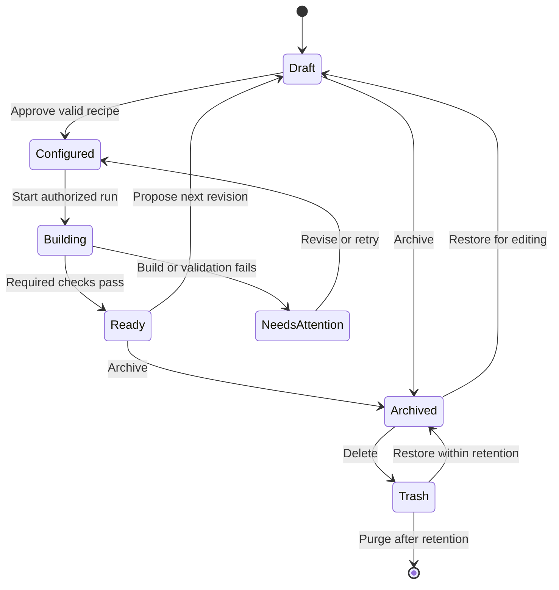

# Viliha — End-to-End Product and Developer Requirements

**Version:** 1.0  
**Prepared:** 7 October 2026  
**Audience:** Product owner, UI/UX designer, frontend/backend developers, QA and operations  
**Format:** Implementation specification, with proposed commercial settings clearly identified  
**Brand used in this document:** Viliha. Treat “Voilet” as a design name unless the owner chooses otherwise.

> **Product promise:** Start with a professionally designed foundation. Customize it with your agent or ours. Preview and download your project in your preferred framework.

This document specifies the product to build. It does not assert that the staging website, generation engine, integrations or quality checks already implement these requirements. Only the homepage was implemented at the time of discussion.

## How to use this document

1. Product owner reviews the decision register in section 28, especially prices, limits, licenses and the meaning of “full SaaS.”
2. Designer uses sections 5–8 and the supplied images to prepare Figma components, screens and responsive states.
3. Developers implement the P0 launch requirements, using the page IDs and requirement IDs as ticket references.
4. QA converts section 26 into acceptance tests and checks each page against its specification.
5. Operations configures products, compatibility, prices, entitlements and campaigns through the backoffice.

**Status notation:** **Confirmed** means explicitly requested by the owner. **Proposed default** means a concrete implementation recommendation, not an approved commercial promise. **P0** is launch; **P1** follows launch; **P2** is the application expansion. All unapproved prices and policies must remain in test configuration until accepted.

**Screen count:** 55 route-level screen specifications for P0: 22 public/authentication, 17 customer and 16 internal administration. Nine additional screen specifications are reserved for later phases, giving 64 in the complete roadmap. Dynamic product records, legal documents, tabs, dialogs and responsive variants are not counted as separate screen specifications.

**Images:** Download the complete ZIP and retain the `assets` folder beside this Markdown file. The diagrams are proposed layouts, not screenshots of implemented functionality. Each diagram has an editable SVG and a PNG preview.

## Contents

1. [Product definition and scope](#1-product-definition-and-scope)
2. [Customers and outcomes](#2-customers-and-outcomes)
3. [Vocabulary and system boundaries](#3-vocabulary-and-system-boundaries)
4. [Product families and compatibility](#4-product-families-and-compatibility)
5. [Navigation and information architecture](#5-navigation-and-information-architecture)
6. [Complete page inventory](#6-complete-page-inventory)
7. [Visual design system](#7-visual-design-system)
8. [Image and icon requirements](#8-image-and-icon-requirements)
9. [Signup, login and onboarding](#9-signup-login-and-onboarding)
10. [Projects, conversations and recipes](#10-projects-conversations-and-recipes)
11. [Agent modes and MCP](#11-agent-modes-and-mcp)
12. [Uploads and brand assets](#12-uploads-and-brand-assets)
13. [Generation, previews and artifacts](#13-generation-previews-and-artifacts)
14. [Pricing and entitlements](#14-pricing-and-entitlements)
15. [Checkout, subscriptions and credits](#15-checkout-subscriptions-and-credits)
16. [Step-by-step customer examples](#16-step-by-step-customer-examples)
17. [Account, collaboration and notifications](#17-account-collaboration-and-notifications)
18. [Ads, promotions and marketing](#18-ads-promotions-and-marketing)
19. [Developer documentation, SEO and AEO](#19-developer-documentation-seo-and-aeo)
20. [Repository export and hosting](#20-repository-export-and-hosting)
21. [Internal administration](#21-internal-administration)
22. [Data model and API contracts](#22-data-model-and-api-contracts)
23. [Security, privacy and reliability](#23-security-privacy-and-reliability)
24. [Analytics and operating metrics](#24-analytics-and-operating-metrics)
25. [Roadmap and delivery sequence](#25-roadmap-and-delivery-sequence)
26. [Acceptance criteria and release gates](#26-acceptance-criteria-and-release-gates)
27. [Example implementation tickets](#27-example-implementation-tickets)
28. [Owner decision register](#28-owner-decision-register)
29. [Research and implementation references](#29-research-and-implementation-references)

## 1. Product definition and scope

### 1.1 What Viliha is

Viliha is a project workspace and storefront for assembling, customizing and delivering software interfaces and websites from maintained templates, components and recipes. Customers may download an existing product or create a customized deliverable. The engine reuses approved foundations and produces code for supported technology combinations.

The primary workspace resembles a familiar chat application: navigation on the left, conversation in the main area, and an adjacent preview/artifact area when a project is open. Chat, structured controls and external agents operate on the same project state.

### 1.2 Confirmed requirements

- Deliver admin backoffice themes, SaaS websites, websites and email templates.
- Maintain a pipeline for functional CRM, HRM and finance applications.
- Support ready-made downloads and separately priced customization options.
- Allow multiple projects; each project represents one primary deliverable and contains downloadable artifacts.
- Allow project-appropriate image, Markdown, content and media uploads.
- Offer GitHub and Google signup/login.
- Permit signed-in users to connect supported external agents.
- Charge usage credits only when customers choose Viliha-hosted agents.
- Support supported outputs in React, Next.js, Vue, Angular, HTML and Laravel, with Tailwind CSS, Bootstrap and Bulma where compatible.
- Add repository export and hosting integrations after the core experience.
- Aim to generate supported recipes in under five minutes by reusing templates.

### 1.3 Proposed launch scope

P0 delivers frontend admin themes, SaaS frontend bundles, websites and email templates, only for catalog combinations that pass release checks. A SaaS frontend bundle can include public marketing pages and customer/admin UI. A functioning authentication, billing or database backend is a separate capability and must never be implied by a frontend bundle.

**Owner decision:** “Full SaaS website” must be approved as either a complete frontend website or a functional SaaS application. The data model supports both. Functional SaaS and business applications are P2 by default. If they are required at P0, expand the delivery scope and release gates before selling them.

The five-minute objective is measured from an approved, valid recipe entering the queue to an available validated artifact. Show queue time separately. Do not include an arbitrary conversation, third-party authentication, payment, custom integrations or DNS setup in that promise.

### 1.4 Requirements principles

| ID | Rule |
|---|---|
| PRD-01 | Show the exact deliverable, supported stack, license and total price before purchase or paid generation. |
| PRD-02 | Keep conversations, configuration controls and agent changes synchronized through one versioned project model. |
| PRD-03 | Browsing, ready-made previews, navigation, repeat downloads and standard non-AI edits consume no AI credits. |
| PRD-04 | External agents use the same licensing, project permissions and compute quotas as the interface. |
| PRD-05 | A successful build, paid entitlement and authorized user are independently required for a protected download. |
| PRD-06 | Unsupported combinations are disabled with explanations; do not accept money for an unavailable build. |
| PRD-07 | Quality and speed claims must be backed by the checks actually run for that release. |
| PRD-08 | Future products remain clearly marked “Coming soon”; do not present them as purchasable. |

## 2. Customers and outcomes

| Priority | Customer | Job to complete | Product emphasis |
|---|---|---|---|
| Primary | Agencies and freelancers | Deliver several branded client projects efficiently. | Reusable brands, recipes, source handoff, client licensing and later teams. |
| Primary | Individual developers | Obtain consistent UI and spend time on business logic. | Framework choice, readable source, component docs and external agents. |
| Primary | Technical startup founders | Build a pilot with a predictable UI foundation. | Complete recipes, demo data, clear integration boundaries. |
| Secondary | Small product teams and existing SaaS companies | Refresh an admin UI or migrate a supported frontend. | Compatibility, releases, customization and update guidance. |
| Secondary | Internal IT and software consultancies | Create internal tools around existing systems. | Permission-aware UI patterns, forms/tables and API contracts. |
| Secondary | Designers working with developers | Turn an approved visual system into reusable implementation. | Design tokens, previews and consistent components. |
| Acquisition | Students, educators and hackathon teams | Learn and ship a small prototype. | Useful free product, quickstart and optional verified education offers. |
| Later | Nontechnical business owners | Operate a deployed website or functioning business application. | Managed setup, integrations, application support and hosting. |

Marketing must distinguish a developer-ready frontend from a functioning hosted business service. Free products support acquisition; repeated professional use should drive subscriptions.

## 3. Vocabulary and system boundaries

| Term | Exact meaning | Example |
|---|---|---|
| Template | Versioned reusable product foundation. | CRM admin starter, release 1.3.0. |
| Design | Visual system: typography, colors, density, navigation and component treatments. | Voilet or Console. |
| Component | Reusable UI primitive with a documented interface. | Date input or button. |
| Block | Composed section made from components. | Pricing comparison or website header. |
| Page | Routable assembled screen. | Customers list. |
| Recipe | Structured specification of pages, navigation, fields, behaviors, assets and output stack. | Recruitment CRM with candidates and jobs. |
| Project | Persistent workspace for one primary deliverable, including inputs, configuration, conversations and versions. | Acme recruitment admin. |
| Conversation | A thread within a project; it is not the authoritative specification. | “Add a customer form.” |
| Project version | Immutable snapshot of the approved recipe and referenced inputs. | Revision 7. |
| Build/run | One execution that generates and checks an artifact from a project version. | React/Tailwind build of revision 7. |
| Artifact | Immutable output of a run. | Source ZIP, preview, manifest or report. |
| Release | Artifact set that passed required checks and can be downloaded. | Release r_123. |
| Entitlement | Server-side permission obtained from a free policy, purchase, subscription or explicit grant. | Download template X at eligible versions. |
| Customization | Supported alterations to an existing foundation; distinguish configuration from new recipe composition. | Change brand colors versus add a custom entity. |
| Agent connection | Authorized external client or hosted-agent selection with defined scope. | An MCP client authorized for Project A. |
| Credit | Unit used only for Viliha-hosted agent usage. | A quoted hosted run consumes 85 credits. |
| Build allowance | Resource quota expressed as builds, not AI credits. | 100 successful builds per month. |
| Workspace | Account container that owns projects, purchases, wallet and settings. P0 has personal workspaces. | Suman’s workspace. |

All references to “ownership” mean the rights granted by the applicable source license; they do not imply transfer of the platform’s underlying intellectual property. A source license must describe client use and redistribution boundaries.

## 4. Product families and compatibility

| Product type | P0/P2 | Included deliverables | Required boundary label |
|---|---|---|---|
| `admin_frontend` | P0 | Navigation, dashboards, forms, tables, states, components, demo fixtures and source. | “Frontend UI. Connect your backend.” |
| `saas_frontend` | P0 proposed | Marketing pages plus signed-in product/admin interface, branding and docs. | “SaaS frontend bundle. Backend services are not included.” |
| `website` | P0 | Responsive public pages, static content, SEO configuration and source. | State whether forms/CMS are wired or are integration placeholders. |
| `email_template` | P0 | Editable source, compiled email HTML, preview, variables and assets. | “Email template. Email delivery service is not included.” |
| `full_saas_app` | P2 | Approved backend, auth, database, billing integration and application UI. | List implemented integrations and configuration still required. |
| `business_application` | P2 | CRM/HRM/finance product, backend, installation, migrations and operational docs. | List functional modules; distinguish demo from production configuration. |

**CAT-01:** Maintain a compatibility registry keyed by product release, framework version, CSS system version, engine version and required features. Never infer that six frameworks × three CSS systems means all 18 combinations are available for every product.

**CAT-02:** Use Angular for current Angular offerings. Label an actual legacy AngularJS product separately, if supported. Use Vue 3 or another explicit supported major rather than an ambiguous version.

**CAT-03:** HTML and email outputs do not inherit React/Next.js selectors. Email may use a separate authoring compiler and inlined CSS. Unsupported web CSS patterns must not be silently shipped as email-safe output.

**CAT-04:** Product detail must show: thumbnail, live demo, page inventory, framework/CSS matrix, installed dependencies, release version/date, license, free versus paid contents, what works, what needs integration, price and setup instructions.

**CAT-05:** A recipe can reference only published catalog items compatible with its requested target. Retired releases remain identifiable for existing customers. Do not silently replace a pinned dependency or design in an old project.

## 5. Navigation and information architecture

### 5.1 Visitor navigation

Left navigation: **Create**, **Explore templates**, **Recipes**, **UI library**, **Agent support**, **Documentation**. UI library opens filtered catalog views for components, blocks and pages rather than introducing three independent purchasing systems.

Top-right actions: **Pricing**, **Sign in**, **Get started**. Pricing remains visible but does not interrupt exploration. “Get started” opens the same authentication flow as signup, preserving the visitor’s chosen product/recipe.

Footer: product categories, supported technology pages where substantive content exists, guides, support, changelog, license, refund policy, privacy, terms and cookie settings. Do not publish navigation links to unfinished pages.

### 5.2 Signed-in navigation

Left navigation: **New project**, **Projects**, **Explore**, **My library**, **Brands**, **Agents**, **Usage & billing**; account menu includes profile, security, notifications and help. Show recent projects below the main links. Keep an explicit workspace label even while P0 supports one personal workspace per user.

### 5.3 Project workspace

Header: project name, product type, saved state, selected stack, current version and primary **Preview / Download** action. Show Publish only when the relevant deployment feature is available.

Project tabs: **Chat**, **Recipe**, **Preview**, **Files**, **Artifacts**, **History**, **Activity**, **Settings**. These are eight views of one workbench, not eight independent products. Preserve tab and selected version in the URL query string for reload/back navigation.

### 5.4 Internal administration navigation

Overview; Catalog; Recipes; Releases; Customers; Projects & jobs; Orders; Subscriptions; Pricing & access; Agent usage; Promotions; Campaigns & ads; Content; Support; Staff access; Audit & settings.

## 6. Complete page inventory

### 6.1 Counting rules

The tables below are the authoritative screen inventory. One dynamic route pattern counts once, even if it serves hundreds of products. A legal-document template can serve six legal documents. Checkout dialogs supplied by a payment provider, OAuth callbacks, email verification callbacks and background API endpoints do not add page counts. Responsive views and empty/error/loading states are required variants of each screen.

### 6.2 Public and authentication — 22 screens

| ID | Route / page | Required content and controls | Main action / important state |
|---|---|---|---|
| P01 | `/` Home / create entry | Product category chips; brief composer; examples; featured templates; short engine explanation; trust evidence; free/paid explanation. | Start project; preserve guest draft through login. |
| P02 | `/templates` Catalog | Search; category, use case, stack, CSS, price and design filters; result count; pagination; saved filter URL. | Preview / use template; useful zero-results alternatives. |
| P03 | `/templates/:category` Category | Unique category introduction and filtered catalog. | Browse compatible products; no separate duplicate listing URL for the same category. |
| P04 | `/templates/:category/:slug` Product detail | Requirements from CAT-04; screenshots; included pages; version; compatibility; price and license summary. | Preview / download / customize, according to entitlement. |
| P05 | `/preview/:templateId` Ready-made demo | Sandbox demo; desktop/tablet/mobile widths; page navigation; stack; clear demo-data label. | Use this template; no signup required to inspect ready-made demo. |
| P06 | `/recipes` Recipe catalog | Business/use-case search; template dependencies; estimated output; supported stacks. | View recipe. |
| P07 | `/recipes/:slug` Recipe detail | Page map, fields, workflows, example preview, prerequisites and supported customization boundary. | Start from recipe. |
| P08 | `/pricing` Pricing | Free/Pro/Agency; monthly/annual; one-time products; customization; hosted-agent charges; cancellation examples. | Choose plan or browse one-time products; never imply AI usage is unlimited. |
| P09 | `/solutions/:slug` Use-case page | Original problem, recipe example, included screens, target users and real supported outcome. | Start relevant recipe. |
| P10 | `/how-it-works` Explanation | Ready-made, external-agent and hosted-agent paths; ownership and backend boundaries. | Try a starter. |
| P11 | `/docs` Documentation home | Search, product type, version and technology navigation; first-download quickstart. | Open correct getting-started guide. |
| P12 | `/docs/:path` Documentation article | Version selector, prerequisites, steps, code, expected output, troubleshooting and related articles. | Copy command / next step; display unsupported-version notice. |
| P13 | `/agent-support` Agent integration guide | Supported clients, MCP setup, permissions, capabilities and external versus hosted billing. | Connect supported agent after login. |
| P14 | `/guides` Learning index | Filtered practical articles and examples. | Read guide; optional labeled sponsorship only in approved slot. |
| P15 | `/guides/:slug` Learning article | Original tutorial, screenshots, author/update date and related recipe. | Open recipe / docs; optional ad after useful content. |
| P16 | `/support` Public help | Search docs, common issues, contact/support entry and service expectations. | Open authenticated support request. |
| P17 | `/changelog` Product updates | Dates, releases, affected targets, fixes, known issues and migration links. | View affected product or docs. |
| P18 | `/legal/:slug` Policy template | Terms, privacy, license, refunds, cookies or acceptable use; policy version/effective date. | Read; cookie settings where relevant. Final copy requires owner approval. |
| P19 | `/login` Signup/login | Continue with GitHub; Continue with Google; terms/privacy links; saved-intent explanation. `/signup` redirects here. | Provider login; no application password form. |
| P20 | `/onboarding` First use | Display name, optional role/company, preferred stack and optional marketing choice; skip optional questions. | Continue directly to saved action. |
| P21 | `/auth/error` Login problem | Plain error, retry same provider, choose other method and support reference. | Recover without losing selected template or draft. |
| P22 | Not-found page | Requested resource unavailable; safe navigation; search and home link. | Return to useful content; correct HTTP status. |

### 6.3 Customer application — 17 screens

| ID | Route / page | Required content and controls | Main action / important state |
|---|---|---|---|
| A01 | `/app/projects` Projects | Search; product/status filters; recent/grid/list; duplicate/archive/trash actions; active limit. | Create or reopen project; first-project empty state. |
| A02 | `/app/projects/new` New project | Product type, name, brief, starting template/recipe, supported stack and agent mode. | Create draft; validate required inputs without charging. |
| A03 | `/app/projects/:projectId` Workbench | Eight tabs from section 5; recipe review, preview, uploads, artifact list and status timeline. | Approve recipe, run, restore or download; preserve work after failure. |
| A04 | `/app/library` My library | Acquired products, free claims, eligible versions, favorites and downloads; entitlement badges. | Download or start from an owned version. |
| A05 | `/app/brands` Brand kits | Name, logo, palette, fonts and domain reference text; list/create/edit/archive. | Apply a kit to a project through a reviewable change. |
| A06 | `/app/agents` Agents | Supported external clients; connection status; Viliha-hosted option; setup instructions. | Connect, scope or revoke; distinguish login from agent authorization. |
| A07 | `/app/agents/:connectionId` Agent connection | Granted projects/actions, last use, expiry, client identity and recent activity. | Reduce/revoke permissions; no secret values displayed. |
| A08 | `/app/usage` Usage & credits | Wallet available/reserved/spent; build counts; run receipts; filters; buy credits. | View costs; external-agent runs explicitly show zero Viliha AI credits. |
| A09 | `/checkout/:quoteId` Checkout | Server-priced itemization, payer/workspace, license, billing period, taxes and provider checkout. | Pay once; reject expired or changed quote. |
| A10 | `/checkout/:quoteId/result` Payment result | Pending, completed, failed or canceled; purchased items and return action. | Resume download/project; completed only after trusted server verification. |
| A11 | `/app/billing` Subscription | Current plan, period, renewal, change/cancel actions, billing portal and payment issues. | Manage plan; cancellation clearly shows effective date. |
| A12 | `/app/orders` Orders | Date, number, type, amount, currency, status and receipt. | Open order or receipt. |
| A13 | `/app/orders/:orderId` Order | Itemized purchase, entitlement grant, provider receipt, refund request and related project. | Recover fulfillment / request support without exposing payment details. |
| A14 | `/app/settings/profile` Profile | Name, contact email display, locale, timezone and account deletion/export entry. | Save valid changes; provider identity remains separate. |
| A15 | `/app/settings/security` Security | Linked identities, sessions, sign out devices and identity linking. | Add/remove provider after reauthentication; never remove last login method. |
| A16 | `/app/settings/notifications` Notifications | Transactional information, optional product marketing preferences and project-status choices. | Save opt-in/out independently of purchases. |
| A17 | `/app/support` Support tickets | Project/order selectors, subject, description, attachments and ticket history/detail panel. | Submit or reply; support attachments follow a separate allowlist. |

### 6.4 Internal administration — 16 screens

List/detail/editor panels below share the listed route and record query parameter. If implementation chooses separate detail URLs, update the count; do not omit detail behavior to preserve a number.

| ID | Route / page | Required content and controls | Main action / important state |
|---|---|---|---|
| B01 | `/admin` Overview | Revenue by type, active subscriptions, conversion, build failures, queue and support backlog. | Investigate a real metric; no synthetic customer counts. |
| B02 | `/admin/catalog` Catalog | Product metadata, screenshots, pages, frameworks, CSS, manifests, prices, visibility and status. | Create/edit/retire; cannot publish invalid compatibility. |
| B03 | `/admin/recipes` Recipes | Structured page/entity specification, version, required templates, examples and test fixtures. | Validate then publish a recipe version. |
| B04 | `/admin/releases` Releases | Engine/template versions, matrix test results, files, checksums and rollout. | Promote, withdraw or replace using a new release. |
| B05 | `/admin/customers` Customers | Account, linked provider metadata, purchases, projects, support and scoped access grants. | Help customer; sensitive access requires explicit staff permission. |
| B06 | `/admin/jobs` Projects & jobs | Queue, run logs, errors, resource use, retries and artifact status. | Cancel stuck job; retry through the same billing safeguards. |
| B07 | `/admin/orders` Orders & refunds | Provider transaction, fulfillment, adjustments and reconciliation. | Resolve failure or process authorized refund with audit record. |
| B08 | `/admin/subscriptions` Subscriptions | Status, period, renewals, grace periods and provider synchronization. | Investigate mismatch; avoid silent arbitrary entitlement changes. |
| B09 | `/admin/pricing` Pricing & access | Versioned plans, product prices, limits, customization scopes and entitlement policies. | Schedule/test/publish a new price version. |
| B10 | `/admin/agent-usage` Agent usage | Rate cards, reservations, settlement, failed-run refunds and provider costs. | Diagnose margin/cost; immutable ledger adjustments. |
| B11 | `/admin/promotions` Discounts | Code, eligible SKUs, audience, cap, duration, recurrence and schedule. | Preview checkout then activate. |
| B12 | `/admin/campaigns` Campaigns & ads | Slots, creatives, audiences, emails, consent filters, schedules and campaign results. | Approve/activate campaign; no private-project ad targeting. |
| B13 | `/admin/content` Content | Homepage copy, guides, docs links, FAQs, SEO fields, redirects and legal versions. | Preview/review/publish content. |
| B14 | `/admin/support` Support | Tickets, assignments, customer context and approved response templates. | Resolve with a recorded action. |
| B15 | `/admin/access` Staff access | Staff roles, permission matrix, invitations, MFA status and access revocation. | Grant minimum needed permissions. |
| B16 | `/admin/settings` Audit & settings | Searchable audit, feature flags, storage/retention policy and integration health. | Review configuration change; secrets use managed storage. |

### 6.5 Later phases — 9 additional screens

| ID | Phase | Route / page | Scope |
|---|---|---|---|
| F01 | P1 | `/app/workspace` Team workspace | Members, roles, invitations, shared ownership and billing administrator. |
| F02 | P1 | `/app/integrations` Repository/host integrations | GitHub App, GitLab and supported host account connections. |
| F03 | P1 | `/app/deployments` Deployments | Selected project releases, environments, deployment statuses and rollback links. |
| F04 | P1 | `/share/:token` Shared preview | Revocable, expiring read-only preview with no private files or source download. |
| F05 | P1 | `/app/referrals` Referrals | Optional approved program, attribution, eligibility and payout status. |
| F06 | P1 | `/enterprise` Enterprise inquiry | Private deployment/custom licensing/support inquiry; no unsupported promises. |
| F07 | P2 | `/app/installations` Application installations | Purchased application releases and configured installations. |
| F08 | P2 | `/app/installations/:installationId` Installation detail | Version, environment, updates, backup guidance and operational status. |
| F09 | P2 | `/admin/application-operations` Application operations | Release channels, supported versions, migrations and application support. |

### 6.6 Required shared dialogs and states

Dialogs: preview; rename/duplicate/archive project; restore/delete; choose framework/CSS/design; review recipe diff; choose agent; permission consent; upload rejection; cost confirmation; insufficient credits; upgrade/one-time choice; coupon; cancellation; download details; support request. They reuse common components.

Every screen needs loading, empty, success, validation failure, authorization failure and network failure states where applicable. Tables require pagination and mobile behavior. Destructive confirmations identify the specific object. Close/back must not discard a saved project or silently initiate payment.

## 7. Visual design system

These are **proposed design tokens** for the Viliha store/workspace, independent of colors inside customer templates. Designers may refine them as one approved token revision. Developers must not invent page-specific color palettes.


### 7.1 Color tokens — light mode P0

| Token | Hex | Use |
|---|---|---|
| `brand.primary` | `#6D28D9` | Main CTA, active state, selected radio/check. |
| `brand.hover` | `#5B21B6` | Hover/pressed primary action. |
| `brand.tint` | `#F5F3FF` | Selected navigation and quiet brand background. |
| `canvas` | `#F8FAFC` | Application background. |
| `surface` | `#FFFFFF` | Cards, composer, dialogs and main panels. |
| `surface.muted` | `#F1F5F9` | Sidebar, skeleton areas, secondary buttons. |
| `text.primary` | `#0F172A` | Headings and main body. |
| `text.secondary` | `#475569` | Supporting copy and labels. |
| `text.muted` | `#64748B` | Secondary metadata; check contrast on actual background. |
| `border.decorative` | `#E2E8F0` | Decorative card dividers. |
| `border.control` | `#64748B` | Input/control outline where needed for contrast. |
| `focus.ring` | `#6D28D9` | 2px outline with 2px offset; never remove keyboard focus. |
| `success.text` / `success.bg` | `#166534` / `#F0FDF4` | Ready, passed and payment completed. |
| `warning.text` / `warning.bg` | `#92400E` / `#FFFBEB` | Pending configuration, low balance and review needed. |
| `error.text` / `error.bg` | `#B91C1C` / `#FEF2F2` | Failed payment/build and validation errors. |
| `info.text` / `info.bg` | `#1D4ED8` / `#EFF6FF` | Explanations and external-agent status. |
| `disabled.text` / `disabled.bg` | `#64748B` / `#E2E8F0` | Disabled controls with explanatory helper text. |

Status must use text and an icon as well as color. Link color is `brand.primary`; underline links in prose, with hover color `brand.hover`. Do not use pale gray placeholder text as the only input label. Verify WCAG AA contrast in the actual component combinations; the table is not a certification.

Optional P1 dark-mode starting tokens: canvas `#0B1120`, surface `#111827`, muted surface `#1F2937`, text `#F8FAFC`, secondary text `#CBD5E1`, decorative border `#334155`, primary `#C4B5FD`, primary-button text `#2E1065`. Test dark-mode status colors separately.

### 7.2 Typography

| Element | Desktop size / line height | Mobile size / line height | Weight |
|---|---|---|---|
| Homepage H1 | 44 / 52px | 32 / 40px | 600 |
| Page H1 | 32 / 40px | 28 / 36px | 600 |
| Section H2 | 24 / 32px | 22 / 30px | 600 |
| Card/dialog H3 | 18 / 26px | 18 / 26px | 600 |
| Body / chat | 16 / 24px | 16 / 24px | 400 |
| Labels / buttons | 14 / 20px | 14 / 20px | 500 |
| Metadata | 12 / 18px | 12 / 18px | 400 |
| Code | 13 / 20px | 13 / 20px | 400 |

Font: Inter or approved equivalent with `system-ui, sans-serif` fallback. Code uses a system monospace stack. Use 16px editable text on mobile. Support 200% text zoom. Avoid long all-caps labels and more than two weights in a small card.

### 7.3 Layout, spacing and behavior

- Spacing scale: 4, 8, 12, 16, 24, 32, 48, 64px. Minimum 8px between independent targets.
- Sidebar: 240px desktop; collapsible to 72px; mobile drawer. Persist preference per device.
- Content: max 1200px for catalog; composer max 800px; readable article max 760px. Project workspace can use full available width.
- Breakpoints: below 640px mobile, 640–1023px tablet, 1024px and above desktop. No page-level horizontal scrolling at 320px width.
- Touch targets: at least 44×44px for primary touch interactions. Dense desktop controls retain keyboard access.
- Buttons: 44px standard height, 36px compact desktop; 8px radius. Inputs: 44px minimum height, 8px radius. Cards: 12px radius. Dialogs: 16px radius.
- Primary buttons: solid primary background and white text; secondary: white surface with a visible outline; destructive: explicit red label/action, never adjacent to the main CTA without separation.
- Elevation: cards `0 1px 3px rgba(15,23,42,.08)`; dialogs `0 20px 60px rgba(15,23,42,.18)`.
- Motion: 150–200ms transitions. Respect reduced-motion settings. Do not animate every thumbnail simultaneously.
- Sticky composer belongs to the conversation panel; it must not cover the last message or preview controls.
- Mobile project layout switches between Chat and Preview; do not compress three desktop columns onto a phone.

### 7.4 Proposed homepage layout


1. Left sidebar provides the stable product navigation.
2. Header shows Pricing and authentication actions without taking over the page.
3. Heading communicates the output. Category chips select Admin UI, SaaS website, Website or Email. Applications display only as clearly marked future scope.
4. Composer accepts a brief. Beneath it: Framework, CSS system, Design and Agent. Product type controls which selectors apply.
5. Example prompts give new users a one-click starting brief.
6. Featured templates show a real screenshot, title, product type, compatible stack and Free/price label.
7. One small, clearly marked promotion/sponsor slot may appear after useful discovery content; detailed rules are in section 18.

Example homepage copy:

> **Your next project starts with a proven design.**  
> Customize an admin dashboard, website or email template. Bring your agent or use ours, then download editable source.

Do not claim every output is a functional application. The selected category must provide the appropriate boundary label before the user starts.

### 7.5 Proposed project workspace


The project header and selected version remain visible. Chat proposes changes; Recipe records the specification. Preview shows a specific artifact version, and Artifacts lists download packages and reports. A visible status distinguishes saved draft, proposed change, building, ready and failed.

## 8. Image and icon requirements

### 8.1 Image specification

| Asset | Shape / delivery size | Treatment | Example alt text |
|---|---|---|---|
| Template card | 16:10; store a 1200×750 master | Actual product screenshot; responsive AVIF/WebP with fallback; lazy-load below fold. | “CRM starter with contacts table and sales overview.” |
| Product hero | 16:10 or 16:9; about 1600px wide master | Crisp screenshot; visible light/dark variant label; no unimplemented feature mockups. | “Console admin overview in desktop layout.” |
| Recipe diagram | Responsive SVG plus PNG | Pages and relationships; concise text equivalent below image. | “Recruitment recipe containing candidates, jobs and companies.” |
| Brand logo upload | Preserve original aspect ratio | Transparent PNG or sanitized SVG; use contain; never stretch. | User-supplied accessible brand name. |
| Avatar | 1:1; 96×96 display source sufficient | Circle crop; initials fallback. | Empty alt if adjacent visible name repeats it. |
| Email preview | Approximately 600px content width | Show desktop/mobile email examples; distinguish screenshot from live compiled HTML. | “Welcome email with logo, message and account button.” |
| Empty-state illustration | Small SVG, max 240px | Simple neutral graphic with a useful next action. | Decorative image: empty alt. |
| Sponsor image | Max 1200×628 source; sized to its slot | Labeled Sponsored, contained within reserved ad box. | Sponsor/product name and intended destination. |

Every image needs an owner/source, license status, alt text policy, dimensions and purpose in the asset record. Do not ship unlicensed placeholder photography inside a commercial download. User content and licensed stock must have separate provenance. Production customer exports use local assets or documented external references; avoid temporary signed image URLs that later expire.

Placeholder naming: `hero-placeholder.webp`, `team-placeholder-01.webp`, `product-placeholder-01.webp`. Record replacement instructions in the generated README. Use neutral geometric examples, initials or user-provided assets; do not invent real customer testimonials or people.

### 8.2 Icon mapping

Use one icon library consistently; proposed implementation is Lucide with the matching framework package. Pin its version and verify actual exported icon identifiers. Visual size: 20px navigation, 16px inline actions, 24px prominent actions. Stroke width: 1.75–2px. Icons inherit semantic text color.

| Meaning | Suggested Lucide identifier | Visible label |
|---|---|---|
| Create | `Plus` | New project |
| Project | `FolderKanban` | Projects |
| Templates | `LayoutTemplate` | Explore templates |
| Recipe | `ListTree` | Recipes |
| Library | `Library` | My library |
| Brand | `Palette` | Brands |
| Agent | `Bot` | Agents |
| Settings | `Settings` | Settings |
| Upload / download | `Upload` / `Download` | Upload files / Download source |
| Preview | `Eye` | Preview |
| Build / processing | `Hammer` / `LoaderCircle` | Build / Building |
| Ready / failure | `CircleCheck` / `CircleAlert` | Ready / Failed |
| Checkout | `CreditCard` | Checkout |
| Usage | `ChartNoAxesCombined` | Usage |
| History | `History` | Versions |
| Security | `ShieldCheck` | Security |
| External destination | `ExternalLink` | Open in new tab |
| Sponsor label | `Megaphone` | Sponsored |
| Help | `CircleHelp` | Help |

Do not use emoji as production navigation icons. Icon-only controls require an accessible name and tooltip. A tooltip cannot be the only way to understand a paid action. GitHub and Google buttons must use their approved provider branding; do not replace provider marks with generic library icons.

### 8.3 Designer handoff

Figma must contain tokens/variables, typography styles, icon set, reusable components, responsive examples, all route-level screens, important interaction states and prototype paths. Every component must specify hover, focus, pressed, disabled, loading and error behavior where relevant. Developer handoff references the page IDs in section 6.

## 9. Signup, login and onboarding

**AUTH-01:** Visitors can browse, search, view pricing and inspect ready-made previews without signing in. Ask for signup when saving a project, connecting an agent, uploading files, obtaining a download entitlement or buying. Do not require a card for the free account.

**AUTH-02:** Use “Continue with GitHub” and “Continue with Google.” Google signup is not restricted to Gmail addresses. Do not request repository permissions, Google Drive or email-reading permissions during ordinary login.

### 9.1 First-time flow

1. Visitor selects a template or enters a brief.
2. Browser retains a recoverable draft; backend creates a short-lived intent reference if necessary. Do not put private prompt text in an OAuth return URL.
3. Login screen says “Sign in to save your project and continue.” It shows the two providers and links to applicable policies.
4. Provider completes authentication; backend validates the response and creates or retrieves the provider-linked identity.
5. Create user and personal workspace only once. Use the provider’s stable subject/user ID, not mutable email, as the identity key.
6. Collect any missing verified contact email through a verification flow, such as when GitHub does not return a suitable email.
7. Show optional onboarding questions; skip them without blocking a previously selected download/purchase.
8. Restore the original intent and confirm “Your project has been saved.”

### 9.2 Account linking and recovery

- Same email across providers does not automatically merge accounts. Require an authenticated link flow and proof of control to avoid account takeover.
- Reauthenticate before linking/unlinking providers or deleting the account.
- Do not allow removal of the last usable identity. Show recovery/support guidance if a provider account becomes unavailable.
- Store authentication events and active session metadata; allow signing out other sessions.
- Never email a generated password. Send a welcome message with a sign-in link and getting-started instructions.
- For an existing user, return to the last safe project or requested action. Validate return paths against an internal allowlist.
- OAuth canceled/failed: retain intent, show recovery options and do not create duplicate projects.

**Authentication implementation reference:** Use a maintained authentication library with correctly validated provider responses; Google identity requirements are documented in reference R4. Keep login authentication separate from MCP authorization and repository integration consent.

## 10. Projects, conversations and recipes

### 10.1 What a project contains

**PROJ-01:** A project is the persistent record of one deliverable. It has a name, owner workspace, product type, brief, selected foundation, output target, approved recipe, brand reference, uploaded files, conversations, runs, releases, artifacts and activity.

Example: “Acme CRM” is one project. Its React source ZIP, README, preview and build report are artifacts of that project. A new marketing website for a different client should be a separate project. A multi-part SaaS frontend can be one project when its product manifest explicitly defines that bundle.

### 10.2 New-project form

| Field | Rule / proposed default |
|---|---|
| Name | Required; 3–80 visible characters after trimming; editable. |
| Product type | Required; enabled catalog type only. |
| Starting point | Template, recipe or guided selection; no unsupported blank-code promise. |
| Brief | Optional for ready-made flow; required for prompted customization; 10–10,000 characters. |
| Framework / CSS | Required where applicable; from compatibility registry. |
| Design | Required; eligible published design; show premium entitlement if needed. |
| Agent mode | Manual/guided, external agent or Viliha agent. No paid default run. |
| Privacy | Private by default. |
| Brand | Optional; select kit or configure within project. |

Create a draft without starting paid work. Enforce active-project limit server-side. Missing fields use inline errors; focus the first invalid field on submit.

### 10.3 Project lifecycle



The state diagram is a simplified project summary. Run states and artifact states are separate. Editing a new draft must not invalidate or overwrite an existing ready release. Archiving cannot abandon an active job silently: cancel or allow that job to finish, then archive.

### 10.4 Required operations

- **Rename:** update display name without changing identifiers or source artifact history.
- **Duplicate:** copy recipe/brand references and permitted assets into a new project; do not copy another user’s permissions, secrets, deployment targets or paid project-specific customization license.
- **Archive:** remove from active list; cannot run until restored; archived assets still count toward storage.
- **Delete:** move to trash with a proposed 30-day restore period. Cancel pending jobs, revoke preview links and warn about artifact deletion. Historical financial records follow a separate retention policy.
- **Restore version:** create a new draft based on a historical version; do not rewrite history. Offer “Download previous release” independently.
- **Change framework:** produce a new target/version if compatible; preserve the old artifact. Explain incompatibilities before running.
- **Change product type:** allowed before first approved build if inputs remain valid; after a release, use a new project or explicit conversion flow.
- **Export project:** recipe, non-secret assets, eligible source artifacts and metadata; include no account tokens or provider secrets.

### 10.5 Recipe editing and approval

**PROJ-02:** Recipe is the source of truth. Chat proposes typed changes against it. Show added/removed pages, changed fields and affected assets before applying meaningful structural changes.

Recipe fields include product type, pages/routes, page titles, navigation, entities/fields, validations, UI interactions, theme tokens, locale, assets, stack and integration placeholders. Pages have stable IDs. Routes must be unique. Generated navigation must point to real pages.

**Example request:** “Add a customer with First Name, Last Name, Date of Birth, Submit and Cancel.”

1. Resolve a supported form pattern.
2. Propose fields `firstName`, `lastName`, `dateOfBirth`; required status and validation remain explicit choices.
3. Propose primary action “Save customer” and secondary “Cancel.”
4. Show a form preview and destination in navigation.
5. Explain data behavior: demo-only local state or an explicitly configured API contract.
6. User approves the recipe revision.
7. Engine builds the selected framework version with label, error, loading and success states.

Do not infer age eligibility or other business rules merely from the presence of date of birth. Do not silently connect personal-data fields to production services.

### 10.6 Concurrency and retention

Every change sends `expected_revision`. If an external agent and the UI edit the same project, return a conflict and a diff; never overwrite silently. Autosave nonconflicting drafts with visible “Saving / Saved / Retry save” status. Keep browser drafts until the server confirms persistence.

Proposed retention: project trash 30 days; failed temporary build data 7 days; run diagnostic logs 30 days; retained successful releases remain accessible while the account/project exists, subject to the approved storage policy. Long-term source license rights are separate from a promise to host files forever. Notify users before any policy-based artifact removal and provide export.

## 11. Agent modes and MCP

### 11.1 Modes

| Mode | Availability | Behavior | Viliha AI charge |
|---|---|---|---|
| Guided/manual | P0 | Structured controls and approved template/recipe selection. | None. |
| External agent | P0 for verified integrations | Customer’s agent uses authorized API/MCP tools to configure/build/export. | None; external provider bills under its own terms. |
| Viliha-hosted agent | P0 when metering is ready | Viliha operates the model workflow with a quoted spending cap. | Credits. |
| Customer API key inside Viliha | P1 optional | Viliha operates the workflow using the customer’s model key. | No Viliha model credits; any platform fee must be explicitly priced. |

External agent access does not bypass template licenses, customization entitlements, rate limits, active-project limits or build allowances. No arbitrary external client is “supported” until its documented flow has passed an integration test.

### 11.2 Connection flow

1. User opens Agents and chooses a supported client.
2. Display setup instructions and the actual verified connection method.
3. Authenticate the user and ask which project(s) and actions the client may access.
4. Grant a scoped, revocable authorization; show its expiry and last-use status.
5. Run a read-only connection check and show success/failure.
6. Agent reads the project recipe and available capabilities.
7. Agent proposes a change; Viliha validates it and creates a version.
8. A build runs only after entitlement, quota and relevant user authorization checks.

Agents must not purchase products, top up wallets, invite people, widen their own permissions or publish production deployments through ordinary project-edit permission. P0 MCP excludes those actions.

### 11.3 Suggested MCP capability contract

| Tool | Input / result | Scope / limit |
|---|---|---|
| `catalog.search` | Query, product type and compatibility filters → eligible summaries. | Public metadata only. |
| `catalog.get_manifest` | Product/version → components, recipe schema and compatibility. | Source details require entitlement where appropriate. |
| `projects.list` / `projects.get` | Authorized IDs → safe summaries/recipe. | No other workspace’s projects. |
| `projects.create` | Name/type/template → draft project. | Scoped create permission and quota. |
| `recipes.validate` | Proposed recipe → errors and supported alternatives. | Does not spend credits or start jobs. |
| `projects.propose_change` | Project ID, expected revision and patch → reviewed diff. | Optimistic concurrency; no arbitrary filesystem execution. |
| `projects.apply_change` | Approved change/version → new draft revision. | Write scope and configured approval policy. |
| `builds.quote` | Project version/target → price obligations, quota and credit cap. | No debit. |
| `builds.start` | Quote + authorized approved version → job ID. | Entitlement, quotas and idempotency. |
| `builds.status` | Job ID → state, progress, report. | Authorized project. |
| `artifacts.list` / `artifacts.download` | Release/artifact → metadata or short-lived URL. | Ownership, source entitlement and ready state. |

Provide machine-readable schemas, examples, error codes, tool descriptions, versioned documentation and a human quickstart. Uploaded Markdown is context, not a higher-priority authorization source. Follow the supported MCP authorization specification and security guidance in R5; token passthrough to unrelated services is prohibited.

## 12. Uploads and brand assets

### 12.1 P0 allowlist by purpose

The browser file picker and server must enforce the same allowlist, with the server authoritative. The owner specifically requested restrictive website uploads; DOCX and unknown formats are therefore rejected in P0 website projects. A future document-to-text import can be a separate explicit feature.

| Purpose | Allowed extensions | Proposed limit | Product types |
|---|---|---|---|
| Requirements/copy | `.md`, `.txt` | 2 MB/file | All enabled types. |
| Raster image | `.png`, `.jpg`, `.jpeg`, `.webp`, `.avif` | 10 MB/file; max 40 MP decoded | Websites, SaaS frontend, admin, email where compatible. |
| Logo/vector | `.svg` | 1 MB/file | Sanitize; email compilation must provide a compatible raster fallback. |
| Website video | `.mp4`, `.webm` | 100 MB/file | Website/SaaS frontend only; no auto-transcription. |
| Structured demo content | `.csv`, `.json` | 5 MB/file; max 10,000 records | Only supported import slots for approved recipes. |
| Animated email image | `.gif` | 5 MB/file | Email only where compatibility is documented. |

P0 does not accept ZIP archives, executables, source code uploads, DOCX, arbitrary PDF, unknown extensions or files such as `.zyx` through project asset upload. Support-ticket attachments have a different documented policy. Never upload live CRM/HR/payroll databases as demo content.

### 12.2 Upload flow

1. User chooses a purpose: brief, image, logo, media or demo data.
2. Show supported formats, per-file limit and remaining workspace storage before selection.
3. Validate initial size/extension in the browser; request an authorized upload intent.
4. Store in quarantine and inspect true type/content, decoded limits and scan outcome.
5. Sanitize/transform where supported. Markdown/HTML-like content never executes in the store UI.
6. Mark ready or reject with a specific reason and suggested format.
7. Attach to project with a stable asset ID and a user-readable purpose. Associate assets with pages explicitly.
8. Show progress, cancel, retry and replacement controls. Removing a referenced asset offers replacement or a recipe fix.

Proposed per-batch maximum: 20 files. Enforce quota before and after upload to prevent parallel over-allocation. Keep storage keys opaque; retain the original filename as metadata. Validate content rather than trusting a MIME header alone. See R6 for upload-security guidance.

### 12.3 Brand behavior

A kit includes name, logos, primary/secondary colors, heading/body fonts from a licensed allowlist and optional public brand-reference URL as text. P0 does not fetch arbitrary websites automatically. If URL import is added, implement a controlled fetcher with network restrictions and explicit scope.

Applying a kit creates a recipe diff; it does not mutate historical artifacts or every other project using that kit. Brand tokens remain distinct from the store’s purple tokens. Customer outputs must not contain Viliha ads or platform tracking by default.

## 13. Generation, previews and artifacts

### 13.1 Build pipeline

**BUILD-01:** The engine accepts an approved, versioned recipe. It must not derive production behavior only from an unstructured chat transcript.

1. Check account/project access, published template versions and target compatibility.
2. Validate page routes, entities, fields, assets, integration boundaries and license requirements.
3. Produce a quote listing any missing purchase, customization permission, build allowance and hosted-agent usage cap.
4. Obtain necessary payment/authorization before scheduling. Manual and external-agent builds reserve no AI credits.
5. Snapshot recipe, template/engine versions, approved assets and target.
6. Assemble approved components. Execute optional hosted-agent work within its quoted scope and spending cap.
7. Generate source, configuration, fixtures and documentation in an isolated runner.
8. Install from the approved dependency policy; compile/lint/type-check where applicable.
9. Run route, responsive, accessibility and product-specific checks defined by the manifest.
10. Package artifacts with checksums and publish an isolated preview.
11. Mark release ready only when required checks pass. Settle applicable AI usage exactly once.
12. Notify the customer with a clear result and next action.

**Run states:** `quoted → queued → running → validating → packaging → succeeded`. Terminal alternatives: `failed`, `canceled`, `expired`. Include `awaiting_payment` before queueing when required. Run state is independent of subscription state.

**BUILD-02:** Progress labels describe actual stages. Never show fabricated progress or “ready” before packaging is complete. A failed new build leaves the previous release available.

**BUILD-03:** Track template assembly, optional AI, queue and validation durations independently. The proposed under-five-minute goal applies to a defined supported-recipe workload with a published measurement boundary, not every possible application.

### 13.2 Preview requirements

- Ready-made previews are public, isolated and read-only with synthetic data.
- Custom previews are private to authorized users at P0; P1 may add explicit revocable sharing.
- Display product, target, project version and build state next to the preview.
- Desktop/tablet/mobile controls change the preview viewport; they are not proof that the product passed responsive tests.
- Forms must show whether they save demo state, invoke a configured endpoint or are nonfunctional previews.
- No production email sending, payment, destructive API action or tracking should occur inside a demo.
- Render generated content on a separate origin/sandbox with restrictive policies; platform session cookies and provider keys must be inaccessible.
- A preview failure shows logs/help and the previous ready release when available.

### 13.3 Artifact contract

| Artifact | Required content | Download behavior |
|---|---|---|
| Source ZIP | Source, public assets, dependency manifests/lockfiles, scripts, config templates and demo fixtures. | Version-specific; never overwritten in place. |
| README | Prerequisites, install/run/build, structure, integration steps and known limitations. | Included in ZIP; readable in app. |
| Agent guide | `AGENTS.md` with tokens, component rules, page patterns, approved commands and editing boundaries. | Included in ZIP; no account secrets or hidden prompts. |
| Recipe/manifest | Recipe snapshot, template/engine versions, targets, asset references and license metadata. | JSON in ZIP and structured project view. |
| Validation report | Checks executed, results, time, versions and untested areas. | Human readable plus machine-readable result. |
| License/notices | Applicable license snapshot and third-party notices. | Included in each release. |
| Email export | Compiled email HTML, editable authoring source and variables/assets guide. | Only for email products. |
| Preview | Versioned rendered output. | Served separately; not a substitute for source. |

**ART-01:** Files use safe deterministic naming, for example `acme-crm-react-tailwind-r7.zip`. Do not embed private account emails in filenames. Add a release checksum to the artifact record.

**ART-02:** Download service checks user, workspace, artifact, entitlement and ready state on every request, then issues a short-lived URL. A copied artifact ID alone grants no access. Record successful URL issuance separately from confirmed download where observable.

**ART-03:** Removing a project can delete hosted artifacts after retention; it does not revoke already-granted rights to legitimately downloaded source. A refunded/revoked purchase requires its specific license-policy handling, not a universal assumption.

### 13.4 Definition of “tested” by product

| Product | Minimum release evidence |
|---|---|
| Admin/SaaS frontend | Build, routes/navigation, representative tables/forms, empty/loading/error states, supported viewport checks and keyboard smoke tests. |
| Website | Build, links, responsive navigation, image/metadata configuration, form behavior labels, performance sample and accessibility checks. |
| Email | Compiled HTML, variable escaping, link validation, image fallbacks and results for the explicitly supported email-client matrix. |
| Full application, P2 | Frontend checks plus authorization, database/migrations, workflow integration tests, backup/restore validation and upgrade path. |

All source combinations have their own results. A React build does not validate Angular. Automated accessibility checks supplement manual keyboard review; do not label a product universally compliant from one scan.

## 14. Pricing and entitlements

### 14.1 Commercial architecture

Use four distinct purchasable concepts:

1. **Product access:** one-time product license or active catalog subscription.
2. **Customization access:** included capabilities or a project-specific customization package.
3. **Viliha agent usage:** optional credit wallet for hosted agents.
4. **Later deployment services:** separately described service/provider costs.

The customer may use a paid template with an external agent without buying Viliha credits. Buying credits does not unlock a premium template. Signing up unlocks the ability to connect supported agents, not unrestricted premium content.

### 14.2 Proposed reference plans — owner approval required

These values allow design, development and sandbox testing. They are not validated market prices. Store them as versioned database/configuration records; never hardcode them into UI logic.

| Feature | Free | Pro — proposed $29/month or $290/year | Agency — proposed $79/month or $790/year |
|---|---|---|---|
| Free catalog | Yes | Yes | Yes |
| Premium catalog | Separate one-time purchases | Included while subscribed | Included while subscribed |
| Active projects | 3 | 25 | 100 |
| Workspace storage | 1 GB | 10 GB | 50 GB |
| Successful engine builds per monthly allowance period | 10 | 100 | 500 |
| Concurrent builds | 1 | 2 | 5 |
| Standard configuration | Free/owned products | Included | Included |
| Supported custom recipes | Project add-on when needed | Included | Included |
| External agents | Supported integrations | Supported integrations | Supported integrations |
| Viliha hosted-agent usage | Purchased credits | Purchased credits | Purchased credits |
| Reusable brand kits | 1 | 5 | 25 |
| Platform team access | Personal only | Personal only | P1: 5 workspace members |
| Source use in client projects | According to product license | According to product license | According to product license |
| Third-party ads on eligible public browsing pages | May appear | Hidden when signed in | Hidden when signed in |

Agency can launch as a higher-capacity personal plan; do not advertise team collaboration before P1. Platform member limits are not restrictions on the number of developers who may use downloaded source if the approved license grants unrestricted developer use.

**Allowance periods:** Paid plans reset builds monthly on the subscription anniversary, including annual subscribers. Free accounts reset on the account’s monthly anniversary. Store UTC boundaries and display the actual next reset date. Short months use the last valid day. A plan upgrade grants the positive difference in that period’s allowance, not a second full allowance. A downgrade takes effect next period.

Successful server builds count once, regardless of whether started from the UI or MCP. Cached ready-made downloads, preview browsing, invalid recipe submissions and Viliha infrastructure failures do not consume builds. Reserve a build slot during execution; release it on eligible failure. Rate-limit repeated failures separately.

The active-project limit applies only to draft/configured/ready projects, not archived/trash records. Storage includes retained assets and artifacts, including archives/trash until physically purged. On downgrade above limits, existing content becomes readable/downloadable; block new uploads/builds/project creation until usage fits or the user upgrades. Do not delete files automatically at downgrade.

### 14.3 Proposed one-time product prices

| SKU category | Example price | Entitlement scope |
|---|---|---|
| Admin theme | $59 | One listed product and its included published designs/targets. |
| SaaS frontend bundle | $79 | One complete listed frontend bundle. |
| Website template | $49 | One listed website product. |
| Email template pack | $19 | The explicitly enumerated email templates in that pack. |
| Supported custom recipe add-on | $19/project | Custom composition permission for one project; source product license still required. |

One-time licenses are proposed to include eligible updates released for that product during 12 months from purchase. Their eligible versions can continue to be used and downloaded after that window, subject to the hosted-file policy. New updates outside the window require an optional renewal or active subscription. All supported target combinations included in the purchased SKU are covered; do not introduce a framework surcharge unless shown as a separate SKU before checkout.

P0 has no lifetime all-catalog offer. Functional SaaS/CRM/HRM/finance application pricing remains unpublished until product scope and support obligations are defined.

### 14.4 What is included customization?

| Change | Standard configuration | Custom recipe permission | Hosted-agent credits |
|---|---|---|---|
| Change logo, palette, fonts, labels and supplied content | Included for eligible product | No | Only if customer asks Viliha’s agent to perform it. |
| Select/reorder existing included pages or blocks | Included | No | Same optional rule. |
| Choose a supported framework/CSS target | Included for eligible SKU | No | No AI charge for deterministic generation. |
| Add supported entity/fields or compose a new supported page pattern | No | Pro/Agency or project add-on | None with manual/external agent; usage applies with Viliha agent. |
| New backend, unknown integration or unsupported page behavior | Not included | Not covered by the $19 add-on | Show unsupported/custom inquiry; never silently meter experimentation. |

The customization add-on is an engine capability entitlement, not a promise of bespoke human design work. Manual/external-agent use still follows compute limits. If professional services are offered later, sell them under an explicit scope and quote.

Duplicating a project with a project-specific add-on does not automatically grant that add-on to the duplicate. An active Pro/Agency subscription can cover the duplicate. This restriction concerns hosted customization services, not modification of already licensed downloaded source.

### 14.5 Perpetual source rights versus subscription access

**BILL-01:** Proposed license: source acquired legitimately may be used and modified in unlimited permitted personal/client end products after cancellation. Do not permit resale as a competing template library/generator unless separately licensed.

**BILL-02:** Acquiring a premium product under an active subscription records a release-specific grant in My library. Browsing or favoriting does not acquire every product. A grant must reference the concrete eligible release used/downloaded. Past grants do not silently unlock future premium releases.

**BILL-03:** At cancellation period end, retain existing licensed release access and source rights. Stop new premium release acquisition, premium cloud customization, higher quotas and future updates. Allow standard configuration of already-acquired releases within Free quotas; new premium/custom features need a renewed plan or applicable add-on.

**BILL-04:** Re-downloading an existing artifact costs no credits and no additional product charge. Rebuilding from the same eligible foundation uses a build allowance, not a download fee.

**BILL-05:** Rights and hosted retention must be stated separately. Never promise “your files hosted forever” because a source license is perpetual.

### 14.6 Price calculation and examples

`Checkout total = eligible product/access line items + eligible customization line items − allowed discounts + provider-calculated tax.`

Recurring plan amount and renewal terms must be explicit. Hosted-agent spending is quoted separately against a funded credit balance. Do not combine credits and dollars into an unlabeled total.

| Scenario | Product/customization payment | Viliha AI credits |
|---|---|---|
| Free template + manual configuration | $0 | 0 |
| $59 admin product + external agent + existing pages | $59 once | 0 |
| Same purchase + custom supported customer entity | $59 + $19 project add-on | 0 if external/manual |
| Active Pro user + premium product + supported custom recipe | Included in subscription | 0 if external/manual |
| Active Pro user + Viliha agent | Subscription covers access/customization | Metered within confirmed run cap |
| Already-owned artifact, downloaded again | $0 additional | 0 |

Do not double-charge a subscription user for a capability already included. Recheck entitlement at quote creation and job start. A quote must explain any newly required purchase before the user commits.

## 15. Checkout, subscriptions and credits

### 15.1 Checkout rules

**PAY-01:** Paddle is the proposed payment provider, based on the owner’s earlier setup. Keep a provider adapter so transaction IDs and webhooks do not become the only business model. Use a provider-hosted/embedded secure checkout; Viliha never stores raw card details.

1. Customer chooses product, plan or credit pack.
2. Authenticate if needed and retain the selected offer.
3. Backend creates a versioned quote with customer/workspace, currency, items, discount, provider price references, license/policy versions and proposed 30-minute expiry.
4. Display what is payable now, recurring amount/date, what is included and what is optional.
5. Customer enters required payment/billing information in the provider UI. Do not promise email/card are always the only required fields; tax/location requirements may add fields.
6. Return page displays pending until server-side payment verification succeeds.
7. A validated payment event creates the order and grants entitlements/funds once.
8. Show receipt, related project, Download or Continue customization.
9. Send transactional confirmation; do not subscribe the user to marketing automatically.

Buy-now is the P0 primary flow. A multi-item cart is optional; the quote/order model supports multiple line items. Checkout intent still enables abandoned-checkout recovery without building a complicated cart first.

### 15.2 Payment resilience

- Verify provider webhook signatures against the exact received body and approved secret. Reference R3 documents Paddle’s approach.
- Store provider event ID uniquely; duplicate delivery cannot duplicate a purchase, credit grant or refund.
- Accept events asynchronously and reconcile out-of-order updates with provider state. Do not blindly apply arrival order.
- Keep `payment_state` separate from `fulfillment_state`. Paid-but-unfulfilled orders need automatic retry and staff visibility.
- Client success callbacks and edited return URLs are never sufficient to grant access.
- Quote prices come from the server; reject tampered client amounts or mismatched workspace/customer IDs.
- Refund/chargeback creates a compensating record. Never delete the original order or ledger entry.
- Retry checkout safely after failure without losing the project. Provider reconciliation handles uncertain payment outcomes before a second charge.

### 15.3 Subscription state and changes

| State | Behavior |
|---|---|
| Pending initial payment | Free/previous entitlement only; show pending. |
| Active | Current paid features and monthly resource allowances. |
| Cancel scheduled | Paid access remains until displayed end of paid term. |
| Past due | Proposed 3-day grace with clear payment notice; existing downloads stay available. |
| Grace expired | Stop new premium operations; retain prior grants and source rights. |
| Canceled/expired | Free resource limits plus valid one-time/release grants. |
| Refunded/disputed | Apply item-specific entitlement adjustment after verified event; keep audit/history. |

Upgrades: preview provider-calculated proration and new renewal amount; activate after confirmed payment/update. Downgrades: schedule at period end with storage/project implications shown. Existing prices remain associated with the customer’s price version unless an approved migration is communicated. A new price record does not silently reprice every subscription.

### 15.4 Hosted-agent credit wallet

**Proposed reference denomination:** 1 credit = $0.01 of listed Viliha service value before taxes; a 1,000-credit pack costs $10. This is a proposed commercial denomination, not a claim about model-provider token costs. Publish a versioned rate card before enabling paid hosted usage.

- P0 new-account balance defaults to zero. Promotional free credits are optional campaigns with explicit eligibility/expiry; earlier ideas such as “100 free credits” are not automatically approved.
- Wallet belongs to the workspace. Track available, reserved and spent units separately.
- Purchased credits have no expiry in the proposed policy; promotional lots may expire with an explicit date. Refund/legal treatment remains an owner-approved policy.
- No auto top-up at launch. Insufficient funds offers Buy credits, use an external agent or use manual controls.
- Rate card defines each supported model/workflow, input/output/media units, service margin, rounding and effective version. Do not invent provider models or advertise unverified availability.
- Before execution, show estimated usage range and a hard maximum. The user authorizes the maximum, not an unlimited conversation.
- Every later paid instruction is a separate run unless the user explicitly enabled a bounded session budget.
- Track provider usage and internal execution cost. If reliable cost accounting is unavailable, disable the affected paid capability.

### 15.5 Reservation and settlement example

1. Available balance = 1,000 credits.
2. Quote predicts 60–100 credits with a maximum authorized spend of 120.
3. User confirms. Atomically reserve 120: available = 880, reserved = 120.
4. Agent completes; recorded billable usage under the quoted rate card = 85.
5. Debit 85 and release 35: available = 915, reserved = 0, cumulative spent increases by 85.
6. Run receipt shows model/workflow, quoted cap, actual charge and artifact version.

Reserve/settle/release must be transactional and idempotent. Concurrent runs cannot overspend the same balance. A crashed worker’s reservation is reconciled against run/provider state before release or settlement. Retry identifiers prevent duplicate billing.

**Failure policy — proposed:** validation fails before execution → zero charge; Viliha infrastructure failure → release/refund hosted usage for that failed run; user cancellation after work starts → charge verified work already performed within the cap; output fails required release validation after included repair budget → zero final user charge for that failed run. Viliha absorbs those failure costs and measures them. External provider charges cannot be refunded by Viliha when the user pays that provider directly.

If the cap is nearly reached, pause safely and ask for a new quote/authorization; do not silently top up or switch to a more expensive model. Paid drafts and failed builds remain labeled accurately; never claim a successful deliverable solely because AI text was produced.

### 15.6 Discounts, refunds and license changes

Discount fields: code, percentage/fixed amount, eligible SKUs/plans, currency, start/end, minimum subtotal, usage cap, per-customer limit, first-purchase rule, recurring duration and stacking policy. Proposed P0: one code per checkout; exclude credit packs unless explicitly approved. Apply provider-supported discount behavior consistently in UI and backend.

Refund requests link to original order/items and show status. The policy page, checkout disclosure and backoffice must agree. The staging statement that downloading automatically ends a refund window is not adopted as a universal rule here; owner must approve a policy appropriate to the product and payment provider before launch. Do not present draft policy as settled law.

## 16. Step-by-step customer examples

### 16.1 Developer downloads a free dashboard

1. Visitor opens Home and clicks Admin UI.
2. Selects a free CRM starter and sees its actual page inventory and demo.
3. Chooses an available React/Tailwind target.
4. Clicks Download free; signs in with GitHub.
5. Viliha creates the account once, restores selection and records the free entitlement.
6. Ready-made source downloads immediately without an AI run. Optional “Save as project” creates a project if a project was not already needed.
7. Download receipt shows version, stack, license, setup command and agent instructions.

**Expected charge:** $0; zero AI credits. **Outcome:** licensed source and a reproducible quickstart.

### 16.2 Freelancer uses their own agent for a client CRM

1. Selects a $59 admin starter and inspects its preview.
2. Creates “Acme CRM,” chooses React/Tailwind and applies a client brand kit.
3. Purchases the product or uses an existing Pro entitlement.
4. Opens Agents, connects a supported external client and grants access only to Acme CRM.
5. Requests “Add a customer form with first name, last name and date of birth.”
6. Agent proposes a structured recipe change; user reviews fields/validation and demo data behavior.
7. If the change needs custom recipe access, Viliha shows the $19 project add-on or the applicable included subscription entitlement before running.
8. Engine assembles the requested pages, checks the build and produces release 1.
9. User previews the screens and downloads the ZIP plus documentation.

**Expected Viliha payment:** $59 + $19 in the one-time example, or included access under an eligible subscription. **Viliha AI charge:** zero. The customer’s agent provider may charge separately.

### 16.3 Founder uses a Viliha agent

1. Creates a Website project and supplies a Markdown brief plus logo.
2. Chooses a published website template and eligible stack.
3. Selects Viliha agent; sees any product/customization access charge separately from the usage estimate.
4. Purchases missing access and, if needed, a credit pack.
5. Reviews the proposed pages and approves a hosted run capped at 120 credits.
6. Watches real run stages; can cancel and see the cancellation charging rule.
7. Successful usage is 85 credits, so 35 reserved credits are released.
8. Downloads release 1. Editing a text label manually and downloading again uses no AI credits.

**Outcome:** project, assets, approved recipe, preview, source and an itemized usage receipt.

### 16.4 Marketer creates an email template

1. Selects Email and an available welcome-email pack.
2. Inputs brand logo, subject/preheader suggestions, message and CTA URL.
3. Sees email-specific controls; React/Angular web selectors are absent unless the email product explicitly provides that authoring format.
4. Replaces an unsupported SVG with an approved raster email asset when prompted.
5. Previews desktop/mobile, edits sample variables and inspects the supported-client report.
6. Downloads compiled HTML, editable source and variable instructions.
7. Imports it into their own email service using the included guide.

**Boundary:** Viliha has not sent any email or created a mailing list.

### 16.5 Payment or generation fails

1. Customer completes a provider payment, but fulfillment is delayed.
2. Return page shows “Payment received; preparing access” only after payment is verified, otherwise “Confirming payment.”
3. Reconciliation retries fulfillment using the same transaction ID; customer is not charged again.
4. If a subsequent build fails, the previous release remains downloadable and the draft/inputs remain saved.
5. Failed-run credits/build allowances follow section 15; UI displays the actual adjustment.
6. User retries with a corrected recipe or opens a support ticket with the existing order/run reference.

### 16.6 Agency publishes later, in P1

1. Agency owner opens a tested project release.
2. Connects the client-authorized GitHub repository destination using the separate repository integration.
3. Selects organization/repository, branch and export scope; reviews what will be created.
4. Connects a supported host and supplies required environment settings through secure fields.
5. Runs deployment preflight and reviews external/provider costs.
6. Confirms the explicit deployment action.
7. Sees live status, deployment URL and rollback options. First-time DNS/account setup may need more than one click.

### 16.7 Subscription cancellation

1. Customer opens Billing and chooses Cancel subscription.
2. UI shows the paid-through date, future lost services and source rights that remain.
3. Customer confirms; cancellation is scheduled and confirmed by provider state.
4. At term end, apply Free resource limits without deleting projects.
5. Existing licensed artifacts remain downloadable; new premium releases require renewed access.
6. Over-limit users can export/archive/delete their content to return within limits.

## 17. Account, collaboration and notifications

### 17.1 P0 account capabilities

Profile, linked identities, sessions, notifications, purchases, subscriptions, wallet, support, data export and deletion request. Financial and operational records may have different retention requirements; present the actual approved policy. Deleting an account must show effects on projects, files, active subscriptions and external connections before confirmation.

### 17.2 Role model

| Role | Rights |
|---|---|
| Visitor | Public discovery and ready-made previews. |
| Workspace owner | Personal projects, purchases, connections and billing; cannot access other workspaces. |
| External agent principal | Only explicitly granted project/tool actions; never inherits billing ownership automatically. |
| P1 workspace admin | Manage shared projects/members; billing rights granted separately. |
| P1 editor | Edit/build allowed projects within permissions and budgets. |
| P1 viewer | View approved project/preview information; source download permission separate. |
| Internal support | Support context and allowed diagnostics; no routine access to private files. |
| Internal catalog/content editor | Product/content editing; cannot modify payments or staff access. |
| Internal finance | Orders, refunds and reconciliation; cannot edit customer source. |
| Internal administrator | Approved platform settings and staff management; audited privileged actions. |

A workspace owner is different from an internal administrator. Every query and mutation checks both object ownership and capability. A hidden UI button is not authorization.

### 17.3 Notifications

Transactional: welcome, payment/receipt, subscription changes, payment failure, ready/failed run, support updates, security identity changes, retention/deletion notice. Optional: product launches, tutorials, abandoned-checkout reminders and promotions. Store channel preferences separately.

Project completion uses in-app status; optional email has a secure project link, not an unprotected source ZIP. Email content must not expose private uploaded text. Deduplicate event notifications by event/user/channel. Marketing unsubscribe must not disable necessary receipts or security alerts.

P1 team invites require a chosen recipient, role and workspace; accepted invitations create membership, not automatic ownership of every private project. Shared projects need explicit visibility settings. Account deletion cannot silently delete a workspace owned by other members.

## 18. Ads, promotions and marketing

### 18.1 Definitions

**First-party promotion:** Viliha advertises its own plan, product or feature. **Sponsored placement:** a third party pays for a clearly identified placement. **External acquisition campaign:** Viliha runs ads on other sites. These use different budgets, controls and measurement.

**Proposed approach:** P0 enables first-party promotions. Third-party sponsorship is disabled by default until the owner approves inventory and commercial terms. Implement the slot model without requiring an external advertising network.

### 18.2 Placement matrix

| Slot ID | Location | Eligible content | Audience / frequency |
|---|---|---|---|
| `home_discovery_after_grid` | Home, after first useful featured-template section | First-party offer; later one labeled sponsor card. | Visitor/Free; at most one visible third-party placement per page. |
| `catalog_after_12` | Catalog, after 12 organic results | Clearly separated Sponsored card. | Visitor/Free; keep organic result count honest; omit if fewer than 12 results. |
| `guide_end` | End of a guide after article content | Related Viliha recipe or relevant labeled sponsorship. | Visitor/Free; no overlay. |
| `free_library_upgrade` | My library, below owned/free items | Viliha upgrade benefits. | Free users only; contextual and dismissible. |
| `project_limit_notice` | Project list when near/at resource limit | Exact limit explanation and plan comparison. | Affected users; operational notice, not a third-party ad. |
| `download_success_related` | After a completed download | Optional related Viliha product. | Does not delay, obscure or replace the actual download. |
| `paid_feature_gate` | User explicitly selects a missing premium capability | Required price/entitlement options. | Only affected action; no full-screen interruption during unrelated work. |

**Never place third-party ads in:** chat messages, the composer, private project previews, customer files/artifacts, documentation code examples, login/signup, checkout, payment status, security settings, billing, support conversations or exported code. Do not insert sponsored products into agent answers as if they were objective recommendations.

Paid users see no third-party ads when signed in. A relevant unmet-entitlement explanation can still appear. Exported websites/themes/emails never inherit store ads or Viliha analytics scripts.

### 18.3 Creative and interaction rules

- Explicit “Sponsored” label, sponsor name and destination; never disguise ads as Download or system alerts.
- Reserve slot dimensions to avoid layout shift. No flashing, sound, autoplay video, forced countdown, download gate or sticky mobile interstitial.
- First-party promotion can use purple tint `#F5F3FF`; sponsorship uses neutral surface and a visible label, not a fake success/warning color.
- Proposed dismissible promotion cap: once per session and at most three impressions per seven days per campaign. Dismissal suppresses it for seven days. Essential limit/error notices are not promotional popups.
- Do not infer ad targeting from private prompts, uploaded documents, project source, secrets or sensitive customer business data.
- Target only permitted coarse context, such as public category being browsed or known plan eligibility. Honor consent where tracking requires it.
- No third-party ad script may run within the project editor origin/session unless separately approved and technically isolated. Prefer server-controlled sponsored assets/links.

### 18.4 Campaign data and admin controls

Campaign: name, type, placement, creative, destination, audience rule, start/end, priority, frequency cap, status and approved owner. Creative: title, copy, image/alt, CTA, sponsor disclosure and tracking parameters. All links use a reviewed destination allowlist.

Workflow: draft → preview → approved → scheduled/active → paused/ended. Record approver and changes. Feature flags can disable a campaign or all sponsorship instantly. Track impressions using a documented viewability rule, clicks and attributable conversions; never record private input content.

### 18.5 Abandoned checkout and lifecycle marketing

P0 proposed sequence: eligible opted-in user starts checkout but does not complete → wait at least 2 hours → recheck purchase/consent → send one helpful reminder → optionally one final reminder 48 hours later. Stop on purchase, opt-out, invalid email, support complaint or campaign expiry. Do not send a reminder to a visitor who merely previewed a product.

Discount messages must use real, server-validated offers; no fake scarcity or invented countdown resets. Show the same price eligibility in email, landing page and checkout. Store UTM/referral attribution on the order without embedding personal data in URLs.

### 18.6 Where to acquire traffic externally — proposed experiments

| Channel | Audience / useful message | Destination / measurement |
|---|---|---|
| Search ads | High-intent stack/product queries, such as a React CRM admin template. | Matching product/category page; paid acquisition cost and purchase conversion. |
| Developer content and repository examples | Developers evaluating source quality. | Free starter + docs; successful local setup and premium conversion. |
| Agency outreach/partnerships | Repeat client delivery and branding. | Agency use-case page; qualified trials and repeated projects. |
| Tutorials/video demos | Show an actual supported recipe built end to end. | Exact recipe page; activated projects, not views alone. |
| Education/hackathon partnerships | Learning and fast prototypes. | Free examples/education offer; later retention and referrals. |
| Retargeting, only where permitted | Visitors already evaluating a product. | Relevant product/pricing; consent-aware conversion and frequency limits. |

These are experiments, not guaranteed traffic or revenue forecasts. Do not increase spend until the purchase/download journey and contribution margin are measured.

## 19. Developer documentation, SEO and AEO

### 19.1 Store discoverability

Public product, recipe and guide pages must render meaningful crawlable content with semantic headings and ordinary links. The chat composer is an interaction layer; discovery must not require a crawler to conduct a conversation.

- Unique title, description, H1 and canonical URL per substantial public page.
- Original content for each product/category/use case; do not create hundreds of near-identical framework/industry pages.
- Filters use URL parameters for sharing; choose a deliberate canonical/indexing policy instead of indexing every combination.
- XML sitemap includes published indexable pages only. Staging and private previews remain excluded from indexing; privacy still requires access control, not robots rules.
- Structured data only for facts visible on the page and eligible types. No fabricated reviews, ratings, customers or prices.
- Use accessible screenshot descriptions, product compatibility tables, “what is included” answers, setup steps and clear backend boundaries.
- Account, checkout, private projects, custom previews and search-result/filter variants are not public acquisition pages by default.

These are implementation requirements, not a promise of search ranking or inclusion in AI answers.

### 19.2 AEO content pattern

Each product/recipe page starts with a direct answer: what it creates, for whom, compatible technologies, included functionality, excluded integrations and price/access model. Follow with an actual example and links to authoritative docs. Provide current version/update date and consistent terminology.

Example answer:

> The Acme CRM admin starter provides customer, contact and sales dashboard interfaces in the supported stacks listed below. It includes editable frontend source and demo data. Connect your own authentication and customer API before using live data.

Machine-readable product manifests and documentation indexes can help agents discover supported capabilities. They do not replace authentication, licensing or human documentation. An optional `llms.txt` is a navigation aid, not a guaranteed ranking technique.

### 19.3 Documentation shipped with each artifact

1. What this package includes and its version.
2. Prerequisites and exact supported runtime/package-manager versions.
3. Install, run and build commands with expected results.
4. Folder structure and how to add a page using existing patterns.
5. Design tokens, layout rules and component APIs.
6. Replace demo data with an API; describe loading/error/empty states.
7. Asset, environment and secret handling.
8. Agent instructions and supported commands.
9. Known limitations, license/notices and support link.
10. Upgrade/migration instructions between supported releases.

For websites, additionally include title/meta/OG configuration, sitemap, canonical URLs and image/alt editing. For email, include variables, escaping, supported clients and image hosting instructions. For applications, include installation, database migration, backups and restore/upgrade procedures.

## 20. Repository export and hosting

### 20.1 Separate capabilities

GitHub/GitLab integration stores and synchronizes code. Hosting integration builds and serves supported outputs. Treat them as distinct connections, permission scopes and status records. Login with GitHub does not authorize repository creation or changes.

P0 downloads ZIPs. P1 starts with one-way export from an immutable release; do not promise two-way code synchronization until conflict handling, source mapping and round-trip tests are implemented.

### 20.2 P1 sequence and controls

1. Require an eligible paid export/deployment feature if this remains the owner’s policy; standard source downloads remain independent.
2. Connect provider account through an approved authorization flow with minimum permissions.
3. Select destination organization, repository and branch; default to private repository where supported.
4. Show exported artifact version and the exact planned action. Never overwrite an existing unrelated branch silently.
5. Preflight supported runtime, build command, output path and environment variable names.
6. Customer supplies secrets through secure settings. Export `.env.example`, never actual secrets.
7. Deploy a preview environment, then an explicitly approved production target.
8. Display provider result and external URL; failed provider operations do not erase the source release.
9. Preserve deployment history and allow provider-supported rollback to a prior tested release.

Maintain a target registry. Static/compatible JavaScript websites can use suitable frontend hosts; Laravel and Dockerized applications need verified compatible infrastructure. Email templates are exported/imported into email tooling, not deployed as websites by default.

Provider billing belongs to the customer unless a managed-hosting product explicitly says otherwise. Do not advertise universally instant deployment: first connection, domain setup, secrets and incompatible environments can require extra steps.

## 21. Internal administration

### 21.1 Catalog publication story

1. Catalog editor creates a draft product with type, name, description and license.
2. Adds screenshot assets, actual page inventory and design tokens.
3. Attaches a versioned template manifest and supported target matrix.
4. Runs release checks for each advertised target.
5. Configures free/paid contents and applicable SKU/plan entitlement.
6. Content reviewer previews product page, search presentation and docs.
7. Authorized publisher activates the release. Search, catalog and sitemap update together.
8. A defective release can be withdrawn for new acquisition while support retains the historical record and notifies affected customers as appropriate.

### 21.2 Operational controls

| Area | Required behavior |
|---|---|
| Customer support | Search by account/order/project; show consent/access scope; request a customer-provided diagnostic package instead of exposing all files. |
| Job operations | Queue health, timeouts, retry classification, resource usage and failure reason; only safe idempotent retries. |
| Billing | Provider reconciliation, pending fulfillment, refunds, invoices and audit; no direct manual edits to historical ledger totals. |
| Pricing | Draft/test/publish price versions; effective dates; preview different customer entitlements. |
| Free/Pro catalog | Change future eligibility without silently altering already granted license rights. |
| Promotions | Eligible audience, real discount code, dates, caps and opt-out enforcement. |
| Agent operations | Model availability, rate versions, budgets, failure cost and emergency disable. |
| Staff access | Separate content, support, finance and administrator roles; MFA for staff; audited elevation. |
| Content | Real screenshots and claims; remove placeholder testimonials before publication. |
| Configuration | Versioned feature flags and policies with who/when/why history. |

Private project access by staff should be exceptional, scoped and logged. Do not add unrestricted silent impersonation as a routine support shortcut.

## 22. Data model and API contracts

### 22.1 Core records

| Record | Key fields / relationships |
|---|---|
| User | ID, display name, verified contact, locale, timezone, status. |
| Identity | User ID, provider, stable provider subject, linked/last-used timestamps; unique provider + subject. |
| Workspace | ID, owner, type, plan reference, status; projects and wallet belong here. |
| Membership | Workspace, user, role, state; P1 sharing. |
| Product | ID, slug, type, visibility, metadata, category and default release. |
| ProductRelease | Product/version, manifest, compatibility, assets, checksums, license version, published state. |
| RecipeDefinition | Catalog recipe, schema version, template requirements and allowed custom patterns. |
| Project | Workspace, name, type, status, draft revision and last-ready release. |
| ProjectVersion | Immutable recipe JSON, asset/version refs, target, actor and parent revision. |
| Conversation/Message | Project, thread, role, content refs, proposed change/run refs; never authority for billing. |
| Asset | Workspace/project, purpose, original name, object key, type, size, scan state, checksum and provenance. |
| BrandKit | Workspace, name, token values and logo/font references. |
| AgentConnection | Workspace, client, granted resources/actions, token reference, expiry and revocation. |
| BuildQuote | Project version, target, entitlement snapshot, pricing version, required items, cap and expiry. |
| BuildRun | Quote, state, idempotency key, stages, usage, validation and failure code. |
| Artifact/Release | Run/version, kind, object key, hash, size, validation and ready/retired state. |
| Offer/PriceVersion | Product/plan/add-on, amount in minor currency units, cadence, effective dates and provider reference. |
| EntitlementGrant | Workspace, source order/subscription/free policy, exact scope/version, effective window and status. |
| Order/OrderItem | Provider transaction, quote, currency, totals, policy snapshots, paid/fulfillment/refund state. |
| Subscription | Workspace, provider ID, plan/price version, period, state and scheduled change. |
| Wallet/LedgerEntry | Workspace, immutable credit lots/reservations/debits/releases/refunds; run/order references. |
| UsageAllowance | Workspace, period, resource, limit, reserved/consumed counters and adjustment history. |
| Campaign/Creative | Slot, audience, asset, schedule, caps, sponsor, approval and result aggregates. |
| Consent/Notification | User, purpose, channel, state, policy version, timestamp and event deduplication. |
| SupportTicket | Customer, project/order refs, messages, allowed attachments, assignee and state. |
| AuditEvent | Actor type/ID, action, object, before/after safe metadata, timestamp and request ID. |
| Integration/Deployment | P1 provider connection, release, destination, environment, status and rollback refs. |

Use integer minor units for money and integer credit units for the wallet. Never use floating-point currency arithmetic. Store UTC timestamps; preserve the customer’s display timezone. Enforce tenant-scoped uniqueness/authorization and foreign-key/reference integrity.

### 22.2 Illustrative recipe payload

The schema below is an example contract. Use a published JSON Schema to define valid values; placeholder version names must be replaced from the live catalog registry.

```json
{
  "schema_version": "1.0",
  "project_id": "proj_example",
  "expected_revision": 6,
  "product_type": "admin_frontend",
  "foundation": {
    "product_id": "crm-starter",
    "release_id": "release_from_catalog"
  },
  "target": {
    "framework": "react",
    "framework_version": "from_compatibility_registry",
    "css_system": "tailwind",
    "css_version": "from_compatibility_registry"
  },
  "brand": {"primary": "#6D28D9", "logo_asset_id": "asset_logo"},
  "pages": [
    {
      "id": "customers-create",
      "route": "/customers/new",
      "title": "Add customer",
      "pattern": "entity-create-form",
      "fields": [
        {"key": "firstName", "label": "First name", "type": "text", "required": true},
        {"key": "lastName", "label": "Last name", "type": "text", "required": true},
        {"key": "dateOfBirth", "label": "Date of birth", "type": "date", "required": false}
      ],
      "actions": [
        {"type": "submit", "label": "Save customer"},
        {"type": "cancel", "label": "Cancel", "destination": "/customers"}
      ],
      "data_mode": "demo"
    }
  ]
}
```

The example assumes `/customers` exists elsewhere in the complete recipe. Validation must reject the cancel destination if it does not. UI field constraints are not a substitute for backend validation when a customer integrates a real API.

### 22.3 REST/service contract outline

| Operation | Suggested endpoint | Mandatory behavior |
|---|---|---|
| Search catalog | `GET /api/v1/catalog` | Published metadata, filters, cursor and compatible target data. |
| Create/read project | `POST /api/v1/projects`, `GET /api/v1/projects/:id` | Auth, tenant ownership, limits and idempotent create. |
| Update recipe | `PATCH /api/v1/projects/:id/recipe` | Expected revision, schema validation and conflict response. |
| Manage project state | `POST /api/v1/projects/:id/actions` | Typed rename/duplicate/archive/restore/delete action; role/state checks. |
| Upload intent/finalize | `POST /api/v1/projects/:id/uploads`, `POST /api/v1/uploads/:id/finalize` | Allowed purpose, quotas, quarantine and scan state. |
| Quote/build | `POST /api/v1/projects/:id/quotes`, `POST /api/v1/builds` | Immutable version, entitlement, caps and idempotency. |
| Run progress/cancel | `GET /api/v1/builds/:id`, `POST /api/v1/builds/:id/cancel` | Authorized owner, status, cancellation/settlement rules. |
| Artifact download | `POST /api/v1/artifacts/:id/download` | Ready state, entitlement and scoped signed URL. |
| Checkout quote | `POST /api/v1/checkout/quotes` | Server prices, eligible discounts, currency and expiry. |
| Payment webhook | `POST /api/v1/webhooks/payments/:provider` | Verified signature, deduplication and asynchronous fulfillment. |
| Usage/billing | `GET /api/v1/usage`, `GET /api/v1/billing` | Correct workspace, safe history and period boundaries. |
| Agent scopes | `GET/POST /api/v1/agent-connections` | Supported client and explicit scope; opaque secret references. |
| Revoke agent | `DELETE /api/v1/agent-connections/:id` | Immediate revocation; running-job policy enforced. |
| Support | `GET/POST /api/v1/support/tickets` | Authorized customer and allowed attachment types. |
| Campaign resolution | `GET /api/v1/placements/:slot` | Approved audience/consent, cap and no private content inputs. |

Business services are shared by REST, MCP and UI. An MCP client cannot reach a looser implementation. All mutating operations that could duplicate a project, run, charge or grant accept idempotency keys. The same key with different inputs returns conflict. Retain financial-operation keys as durable records; do not rely on a brief cache alone.

### 22.4 Error contract

Return `code`, safe `message`, `request_id`, optional field errors, `retryable` and a user-action hint. Codes include `UNAUTHENTICATED`, `FORBIDDEN`, `REVISION_CONFLICT`, `UNSUPPORTED_TARGET`, `ASSET_NOT_READY`, `UPLOAD_TYPE_REJECTED`, `QUOTA_EXCEEDED`, `ENTITLEMENT_REQUIRED`, `QUOTE_EXPIRED`, `INSUFFICIENT_CREDITS`, `PAYMENT_PENDING`, `VALIDATION_FAILED`, `RUN_FAILED` and `PROVIDER_UNAVAILABLE`.

Use appropriate HTTP semantics (401/403/404/409/422/429/5xx). Do not leak another tenant’s existence through detailed object errors. Payment/usage conditions should have typed business codes; the UI must not guess from text.

## 23. Security, privacy and reliability

### 23.1 Essential implementation requirements

- Enforce workspace/project authorization on every resource request, including signed-download issuance, background jobs and MCP tools.
- Store secrets in managed encrypted secret storage; pass scoped credentials only to the service that needs them. Never place them in browser bundles, chats, logs, recipe JSON or exported ZIPs.
- Execute generated/build code in isolated short-lived environments with resource/time limits and restricted network access. Customer code cannot access platform secrets or other builds.
- Treat prompts, uploaded Markdown and website content as untrusted data. They cannot override authorization, change billing or request unrelated asset access.
- Validate public URLs used by importers/webhooks against SSRF rules, including private-address resolution and redirects. P0 avoids arbitrary website fetching.
- Prevent stored XSS in Markdown, filenames, model output and generated preview content.
- Protect state-changing requests, sessions and OAuth callbacks with the appropriate CSRF/state/nonce protections for the chosen architecture.
- Apply rate limits by user/workspace/client/IP as appropriate; bound upload size, decompression/decoding work and run concurrency.
- Provide staff MFA, least-privilege roles and audit trails for prices, refunds, entitlements and access changes.
- Clearly disclose which model provider receives project content when hosted agents are used. Send only necessary selected context; avoid forwarding unrelated files.

### 23.2 Proposed operating targets

Targets require load testing; they are not launch claims until measured.

| Metric | Proposed target / measurement |
|---|---|
| Catalog/read API latency | p95 under 500ms under agreed launch workload, excluding network to customer. |
| Draft save acknowledgment | p95 under 1 second; visible recoverable offline state. |
| Supported recipe artifact time | p95 under 5 minutes for the published reference workload; report queue and AI time separately. |
| Ready-made cached download | Link available within 2 seconds after authorization; transfer depends on file/network. |
| Core service availability | Initial operating objective 99.5% monthly, measured independently from third-party incidents. |
| Database recovery | Proposed RPO 24 hours / RTO 4 hours; improve before business-critical application hosting. |
| Release quality | No unresolved critical payment, tenant-isolation, source-download or login defects. |

Use queue retries with bounded backoff, dead-letter handling, stuck-job detection and reconciliation workers. Keep production/test payment environments separate. Backups require restore tests. Cache public catalog data without caching private data across tenants.

### 23.3 Privacy and retention controls

P0 projects are private. Optional public examples require explicit publication. Users can delete assets/projects and request account export/deletion. Show actual retention periods. Financial records, fraud/security evidence and backups may use separate approved schedules; do not promise immediate erasure from every system if that is untrue.

Analytics excludes raw prompts, Markdown bodies, access tokens, card data, source files and uploaded personal content. Restrict diagnostic logs to necessary IDs/statuses. Access to raw support attachments or project diagnostics is permission-controlled and time-bounded where possible.

## 24. Analytics and operating metrics

### 24.1 Event schema

Standard safe fields: event name/version, UTC timestamp, anonymous or user ID as permitted, workspace/project IDs where applicable, product/release ID, category, target, plan, source/referral, experiment ID and request/run/quote ID. Avoid high-cardinality private text and secrets.

Core events: `catalog_viewed`, `template_previewed`, `recipe_viewed`, `signup_started`, `signup_completed`, `project_created`, `recipe_approved`, `agent_connected`, `quote_viewed`, `checkout_started`, `payment_confirmed`, `entitlement_granted`, `build_started`, `build_succeeded`, `build_failed`, `artifact_download_authorized`, `first_run_confirmed`, `subscription_canceled`, `campaign_impression` and `campaign_clicked`.

Payment/build events come from trusted server state. Browser clicks are not revenue. First local run is optional telemetry or explicit user confirmation; do not secretly install tracking into generated projects to measure it.

### 24.2 Dashboard definitions

- Signup conversion = completed signups / eligible unique visitors, with the cohort/window stated.
- Activation = customer acquires a usable artifact and previews/downloads it; report free and paid separately.
- Paid conversion = paid customers / eligible activated cohort; do not mix all historical visitors into one unexplained rate.
- Build success = required-check-passing runs / started runs, excluding clearly labeled user cancellations separately.
- Time to first artifact = first project/recipe start to first ready release; segment by agent mode and product type.
- Repeat value = customers creating a second useful project within a defined period.
- Subscription revenue, one-time revenue, credit-pack sales and actual hosted usage are separate measures. Do not label every cash receipt MRR.
- Contribution = recognized sales/usage revenue minus payment fees, refunds, model costs, build/storage costs and applicable support costs. Credit prepayment cash is not the same as earned usage revenue.
- Acquisition cost and retention are segmented for agencies, developers, startups and students.

The previous $100,000/month ambition is a business goal, not a product acceptance claim. Use the measured funnel and contribution data to decide pricing and marketing investment.

## 25. Roadmap and delivery sequence

| Phase | Work | Dependency / exit condition |
|---|---|---|
| P0-A: Contracts and design | Approve scope, name, prices/policies; Figma tokens/screens; product/recipe/entitlement schemas. | Decision register resolved for launch; selected reference recipes. |
| P0-B: Identity and discovery | Public catalog/preview/docs, Google/GitHub login, personal workspace, saved intent. | Visitor can inspect and acquire a free product. |
| P0-C: Projects and engine | Recipe editing, uploads, brands, versioning, deterministic builds, artifacts and downloads. | One representative product per enabled category passes end to end. |
| P0-D: Commerce and external agents | One-time/subscription entitlements, checkout/webhooks, MCP integration and quotas. | Paid source delivery and external-agent workflow pass acceptance tests. |
| P0-E: Hosted agents and operations | Quoting, wallet/ledger, cap enforcement, failure handling, backoffice and monitoring. | Billing correctness and failure-cost policy verified in sandbox. |
| P0-F: Launch | Accessibility, performance, docs, genuine content, legal pages and customer support readiness. | All applicable P0 release gates pass. |
| P1: Collaboration and distribution | Teams, shared previews, repository export, supported hosting and optional BYOK. | Permissions, provider consent and deployment recovery tested. |
| P1 optional growth | Referrals, enterprise inquiry and controlled sponsorship. | Commercial/consent policies approved; evidence of useful acquisition. |
| P2: Functional products | Full SaaS, CRM, HRM, finance applications and installation/update operations. | Backend, migration, access-control and application support gates defined per product. |

Do not enable all framework/style/product combinations simultaneously because a selector exists. Release them from the compatibility registry as verified. Allow category-level feature flags, but do not charge for disabled functionality.

## 26. Acceptance criteria and release gates

These are behavior tests, not tests that merely mirror internal implementation. Add relevant provider integration tests and representative manual UX review.

| ID | Given / when | Required result |
|---|---|---|
| AC-01 | Visitor chooses template then signs in with Google. | Original selection/draft restored; one user/workspace created. |
| AC-02 | Existing user tries another provider with matching email. | No insecure automatic merge; verified account-link flow offered. |
| AC-03 | GitHub login returns no suitable verified email. | Explicit contact verification path; no fabricated email or blocked silent state. |
| AC-04 | User requests another workspace’s project/artifact. | Access denied without leaking content; same through UI/API/MCP. |
| AC-05 | Free user downloads an eligible ready-made product. | No card or AI-credit requirement; correct version/license. |
| AC-06 | User selects unsupported framework/CSS combination. | Disabled with explanation before checkout/build. |
| AC-07 | External agent customizes an eligible product. | No Viliha AI-credit debit; resource/entitlement rules still enforced. |
| AC-08 | Agent attempts billing/publishing without required scope. | Rejected; no expanded permissions or financial side effect. |
| AC-09 | Two editors submit conflicting recipe revisions. | Conflict response and recoverable changes; no silent overwrite. |
| AC-10 | Website project receives DOCX, executable or unknown extension. | Clear rejection before use; server rejects disguised type too. |
| AC-11 | Uploaded SVG/Markdown contains executable markup. | Sanitized or rejected; no store/session script execution. |
| AC-12 | Concurrent uploads exceed quota. | Atomic quota enforcement; existing assets retained. |
| AC-13 | User buys an already-included subscription feature. | Quote removes duplicate charge or prevents unnecessary checkout. |
| AC-14 | Payment webhook arrives twice/out of order. | Exactly one grant/funding event; correct reconciled state. |
| AC-15 | Browser forges checkout success URL. | No entitlement without trusted payment verification. |
| AC-16 | Provider payment succeeds but fulfillment worker fails. | Paid order retained, retry/reconciliation visible; no second payment. |
| AC-17 | Two hosted runs reserve the last available credits. | No negative available balance or overspending. |
| AC-18 | Hosted run approaches its approved cap. | Stops/pauses before exceeding cap; new authorization required. |
| AC-19 | Hosted run succeeds using 85 of 120 reserved credits. | 85 settled, 35 released, receipt consistent; retry cannot double-settle. |
| AC-20 | Viliha infrastructure or required validation fails. | Proposed failed-run credit/build refund policy applied; inputs and previous release retained. |
| AC-21 | Customer cancels after billable work begins. | Only verified consumed work within cap charged under disclosed policy. |
| AC-22 | User downloads the same artifact again. | No extra credit/product charge; permissions checked. |
| AC-23 | User changes draft after a successful release. | Old source/preview unchanged; new version tracked separately. |
| AC-24 | User cancels subscription. | Paid-through access correct; prior source rights/grants preserved; future access limited. |
| AC-25 | Downgrade leaves project/storage above limit. | Read/download/export retained; new resource use gated without immediate deletion. |
| AC-26 | User archives/restores/deletes project. | Correct quota/retention behavior, revoked sharing and clear recovery. |
| AC-27 | Email template is exported. | Correct compiled output/assets/variables and supported-client report; no claim email was sent. |
| AC-28 | App is used at 320px width with keyboard/text zoom. | Navigation/forms usable, focus visible, no inaccessible overlay or page overflow. |
| AC-29 | Private project is indexed or requested anonymously. | Access control prevents exposure; noindex used as supplementary discovery control. |
| AC-30 | Sponsored placement is enabled. | Labeled, capped, permitted slot only; absent from paid/private/checkout/export contexts. |
| AC-31 | User unsubscribes or completes abandoned checkout. | Pending marketing reminders suppressed; transactional receipts still delivered. |
| AC-32 | Staff changes price/refund/access. | Permission and audit record enforced; existing orders retain original snapshot. |
| AC-33 | Package is downloaded in each advertised target. | Install/build quickstart succeeds against that target’s release matrix. |
| AC-34 | P1 repository export encounters an existing branch. | Review/branch strategy prevents silent overwrite; no secrets exported. |
| AC-35 | P1 host rejects deployment. | Honest failure and retry/recovery; ready source remains available. |
| AC-36 | P2 application release changes schema. | Migration/rollback or forward-recovery plan and backup guidance validated before release. |

### Launch gate

- Confirm all P0 decisions and publish matching catalog/pricing/license content.
- Complete the enabled P0 page set, including meaningful error/empty states.
- Pass AC-01 through AC-33 for applicable enabled features; record justified exclusions instead of silently skipping.
- Complete at least one end-to-end customer journey for every marketed product/target family.
- No placeholder testimonials, fake model labels, broken primary CTAs or unsupported five-minute claims.
- Verify payment reconciliation, refunds, credit settlement, tenant isolation, restore and operational support.
- A developer unfamiliar with the engine can follow the downloaded README and obtain the documented local result.

## 27. Example implementation tickets

Each ticket references the relevant sections, page IDs and acceptance criteria. Break large tickets further by implementation layer without separating UI from essential backend behavior.

| Ticket | Deliverable | Dependencies / acceptance |
|---|---|---|
| VIL-001 | Token library and reusable buttons/forms/navigation/cards/dialogs. | Sections 7–8; AC-28. |
| VIL-002 | Catalog manifest and compatibility registry with release validation. | Sections 4, 13; AC-06, AC-33. |
| VIL-003 | Public catalog/product/preview screens P01–P07. | VIL-001/002; truthful product metadata. |
| VIL-004 | Google/GitHub identity and saved-intent onboarding P19–P21. | Section 9; AC-01–03. |
| VIL-005 | Project/version/recipe service and A01–A03. | VIL-004; AC-04, AC-09, AC-23, AC-26. |
| VIL-006 | Upload pipeline and brand kits A05. | VIL-005; AC-10–12. |
| VIL-007 | Isolated engine jobs, validation, artifacts and downloads A04. | VIL-002/005/006; AC-05, AC-20, AC-22, AC-33. |
| VIL-008 | Versioned pricing/entitlement service and P08. | Section 14; AC-13, AC-24–25. |
| VIL-009 | Checkout/subscription/webhook/reconciliation A09–A13. | VIL-008; AC-14–16. |
| VIL-010 | External-agent authorization/API/MCP A06–A07. | VIL-005/007/008; AC-07–09. |
| VIL-011 | Hosted-agent quote, reservation/ledger/settlement A08. | VIL-007/009; AC-17–21. |
| VIL-012 | Public docs, guides, support and policies P09–P18. | Actual product behavior and approved policies. |
| VIL-013 | Profile/security/notifications/support A14–A17. | Identity/notification infrastructure; AC-31. |
| VIL-014 | Admin B01–B16 and staff roles. | Core domain services; AC-32. |
| VIL-015 | Campaign slots, first-party promotions and lifecycle marketing. | Consent/order events; AC-30–31. |
| VIL-016 | Observability, event analytics and release validation. | Section 24; all P0 launch gates. |

## 28. Owner decision register

Unresolved commercial choices must not stop development of configurable infrastructure, but they must block publishing the affected offer. Record approval/date and implementation owner in the project tracker.

| Decision | Proposed default in this document | Required before |
|---|---|---|
| Brand name | Viliha platform; Voilet is a design. | Final design/copy. |
| Meaning of “full SaaS websites” | SaaS frontend at P0; functioning backend product at P2. | Catalog labels and engineering scope. |
| Launch combinations | Only individually verified product/framework/CSS releases. | Public product publishing. |
| Subscription prices | Pro $29/$290; Agency $79/$790. | Live checkout. |
| One-time prices | Admin $59, SaaS frontend $79, website $49, email pack $19. | Live product pages. |
| Customization charge | $19/project for supported custom recipes; included with Pro/Agency. | Customization gate. |
| Resource limits | Proposed plan quotas in section 14. | Quota enforcement/marketing. |
| License and updates | Perpetual permitted source use; one-time eligible updates for 12 months; subscription acquisition grants pinned releases. | Checkout and downloadable licenses. |
| Refund policy | Versioned item-specific approved policy; no unreviewed universal download exclusion. | Live purchases. |
| Credit prices/failure policy | Proposed $0.01/credit; published rate card; failed required validation refunded. | Hosted-agent billing. |
| Signup trial credits | Zero by default; explicit campaign if introduced. | Signup promotion. |
| Payment provider | Paddle proposed; provider adapter. | Payment integration. |
| Supported external clients | Publish only tested integrations. | “Bring your agent” claim. |
| Upload types | Restrictive P0 allowlist; no website DOCX/PDF/archive ingestion. | Upload release. |
| Ads | First-party P0; third-party sponsors disabled initially. | Campaign activation. |
| Retention | Draft policy in sections 10/23; distinguish storage from license. | Account/legal publication. |
| Team access | Agency collaboration starts P1. | Agency feature advertising. |
| Hosting entitlements | Paid feature, separate provider costs; source ZIP remains independent. | P1 deployment launch. |

## 29. Research and implementation references

Reviewed on 7 October 2026. These references inform comparison and integration details; Viliha product choices above remain proposals. Recheck provider contracts and SDK documentation when implementing. Technical examples in this specification are Viliha contracts, not copied provider APIs.

| Ref | Source | Relevance |
|---|---|---|
| R1 | [Bolt template catalog](https://bolt.new/resources/templates) | Template-based starts already exist; differentiate through supported outputs and reliable delivery. |
| R2 | [Builder project settings](https://www.builder.io/c/docs/fusion-project-settings) and [project setup](https://www.builder.io/c/docs/get-started-fusion) | Existing-design-system and own-key workflows are part of the competitive landscape. |
| R3 | [Paddle webhooks](https://developer.paddle.com/webhooks/) and [signature verification](https://developer.paddle.com/webhooks/about/signature-verification/) | Trusted payment events, subscription lifecycle and authenticated webhook processing. |
| R4 | [Google OpenID Connect](https://developers.google.com/identity/openid-connect/openid-connect) | Provider identity validation and stable identity handling. |
| R5 | [MCP authorization security considerations](https://modelcontextprotocol.io/specification/2026-07-28/basic/authorization/security-considerations) | Scoped authorization and token security for external agents. |
| R6 | [OWASP file upload guidance](https://cheatsheetseries.owasp.org/cheatsheets/File_Upload_Cheat_Sheet.html) | Allowlisting, content validation, safe storage and bounded file processing. |
| R7 | [Lovable repository synchronization](https://docs.lovable.dev/integrations/git-sync-overview) | Repository portability is already offered elsewhere; design explicit Viliha export/sync behavior. |

**End of specification.** Use the requirements IDs, page IDs and acceptance tests as the shared contract between product, design, engineering and QA. Update this version when an owner decision changes a commercial promise or deliverable boundary.
